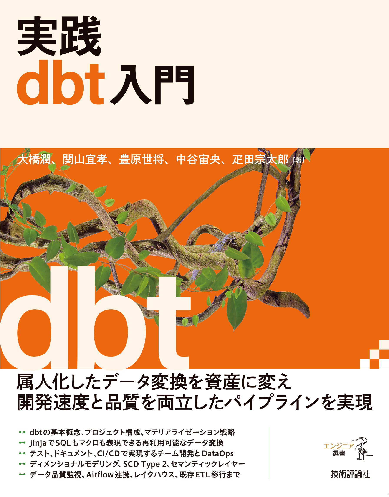

# 『実践 dbt 入門』ハンズオン

『実践 dbt 入門』（技術評論社、2026年）のハンズオンリポジトリです。

<a href="https://gihyo.jp/book/2026/978-4-297-15786-9"></a>

各ハンズオンは書籍本文と合わせて進めることを想定していますが、この README だけを読んでも環境構築から実行まで進められるようにしています。
まず本 README の「[共通の前提条件](#共通の前提条件)」で自分が進める章に必要なツールを用意し、続いて各ハンズオンのディレクトリにある README の手順に従ってください。

なお、書籍に関する正誤表やお問い合わせについては、技術評論社の[書籍ページ](https://gihyo.jp/book/2026/978-4-297-15786-9)よりお願いいたします。

## ハンズオン一覧

| ディレクトリ | 対応する章 | 扱う内容 | エンジン・主なツール | 実行環境 |
| --- | --- | --- | --- | --- |
| [`chapter2/`](chapter2/README.md) | 第 2 章 dbt をはじめよう | `dbt init` から dbt プロジェクトを作り、モデルのビルドまでを体験する | Amazon Redshift Serverless（`dbt-redshift`） | AWS |
| [`chapter2-completed/`](chapter2-completed/README.md) | 第 2 章 dbt をはじめよう | 第 2 章の完成済みプロジェクト。答え合わせや参照に使う | Amazon Redshift Serverless（`dbt-redshift`） | AWS |
| [`chapter3/`](chapter3/README.md) | 第 3 章 チーム開発を支えるテスト、ドキュメント、CI/CD | テスト・ドキュメント生成・GitHub Actions による CI/CD を構築する | Amazon Athena（`dbt-athena`）、GitHub Actions | AWS（VPC 接続は不要） |
| [`chapter4/`](chapter4/README.md) | 第 4 章 実践的データモデリング | staging / intermediate / marts の 3 層構造とディメンショナルモデルを構築する | DuckDB（dbt v2 内蔵アダプタ） | ローカル |
| [`chapter5/`](chapter5/README.md) | 第 5 章 データ品質管理の実践 | テスト・Model Contracts・Elementary・dbt-osmosis で品質管理体制を作る | PostgreSQL 17（`dbt-postgres`）、Elementary、dbt-osmosis | ローカル（Docker） |
| [`chapter6/`](chapter6/README.md) | 第 6 章 ワークフローエンジンによる dbt の運用 | Apache Airflow から dbt とその前後処理を含むワークフローを運用する | Amazon MWAA、Amazon Athena | AWS |
| [`chapter7/`](chapter7/README.md) | 第 7 章 レイクハウスにおける dbt の活用 | Apache Iceberg でレイクハウスを構築し、別エンジンからの参照まで扱う | Amazon Athena（`dbt-athena`）、AWS Glue（`dbt-glue`）、dbt-loom | AWS |
| [`appendixA/`](appendixA/README.md) | 付録 A セマンティックレイヤーの紹介 | MetricFlow のセマンティックモデルとメトリクスを定義し、`mf` CLI でクエリする | DuckDB（dbt v2 内蔵アダプタ）、MetricFlow | ローカル |

第 1 章・第 8 章・付録 B・付録 C には手を動かすハンズオンがないため、このリポジトリには含めていません。

## 共通の前提条件

ハンズオンは大きく分けて、AWS 上にリソースを作る章と、手元の Docker でデータベースを動かす章があります。
以下では前提を「全章共通」「AWS を使う章」「Docker を使う章」に分けて示します。自分が進める章に必要なものだけを用意してください。

インストール手順はツールのバージョンによって変わることがあるため、公式ドキュメントを参照してください。

### 全章共通

#### リポジトリの取得

ハンズオン資材を手元にクローンします。

```bash
git clone https://github.com/ghmagazine/dbt_book_handson
cd dbt_book_handson
```

#### uv のインストール

ローカルで dbt を実行するため、Python パッケージマネージャーの **uv** をインストールします。
手順は [uv 公式ドキュメント](https://docs.astral.sh/uv/getting-started/installation/) を参照してください。macOS / Linux 向けのインストールスクリプトと、Windows 向けの PowerShell 用コマンドがそれぞれ用意されています。

インストール後は、新しいターミナルを開くかシェルの設定を再読み込みして、`uv` コマンドが使えることを確認してください。

### AWS を使う章（第 2 章・第 3 章・第 6 章・第 7 章）

これらの章では、AWS 上に Redshift Serverless や Athena、MWAA などのリソースを作成します。
以下の準備は共通です。

#### AWS アカウントと IAM ユーザー

AWS アカウントを持っていない場合は、[AWS 公式ドキュメント](https://docs.aws.amazon.com/ja_jp/SetUp/latest/UserGuide/setup-prereqs-instructions.html)の手順でアカウントを作成してください。

日常的な操作にルートユーザーを使うことは避け、IAM ユーザーを作成して使います。
[公式ドキュメント](https://docs.aws.amazon.com/ja_jp/IAM/latest/UserGuide/id_users_create.html)の手順で新しい IAM ユーザーを作成し、`AdministratorAccess` ポリシーをアタッチしてください。

> [!NOTE]
> `AdministratorAccess` は非常に強い権限です。本ハンズオンは幅広い AWS サービスを扱うため手順の簡略化を目的に付与しますが、実際の運用環境では必要最小限の権限だけを付与する「最小特権の原則」に従ってください。

#### AWS CLI のインストールとサインイン

AWS CLI は、コマンドラインから AWS サービスを操作するためのツールです。
[公式ドキュメント](https://docs.aws.amazon.com/ja_jp/cli/latest/userguide/getting-started-install.html)の手順に従ってインストールしてください。

作成した IAM ユーザーの権限で操作するため、`aws login` を実行します。
複数の AWS 環境を使い分けている場合に既存のデフォルトプロファイルを上書きしないよう、本ハンズオンではプロファイル名を `dbt-book` として登録します。

```bash
aws login --profile dbt-book
```

ブラウザが開くので、作成した IAM ユーザーでサインインしてください。
成功すると `~/.aws/config` に `[profile dbt-book]` が追加され、一時クレデンシャルが `~/.aws/login/cache/` 配下に保存されます。

#### AWS_PROFILE と AWS_DEFAULT_REGION の設定

各章のハンズオンでは、この `dbt-book` プロファイルを使うよう環境変数 `AWS_PROFILE` を設定します。また、本書の AWS ハンズオンでは、特に断りがない限り東京リージョン（`ap-northeast-1`）を使用するため、`AWS_DEFAULT_REGION` も設定します。

```sh
# macOS / Linux (bash / zsh)
export AWS_PROFILE=dbt-book
export AWS_DEFAULT_REGION=ap-northeast-1
```

```powershell
# Windows (PowerShell)
$env:AWS_PROFILE = "dbt-book"
$env:AWS_DEFAULT_REGION = "ap-northeast-1"
```

> [!NOTE]
> `AWS_PROFILE` と `AWS_DEFAULT_REGION` はターミナルのセッションごとに設定が必要です。ターミナルを開き直したら、再度設定してください。
> また、`aws login` の一時クレデンシャルは最大 12 時間で期限切れになります。期限が切れたら `aws login --profile dbt-book` を再実行してください。

#### AWS Budgets の設定

想定外の課金を避けるため、請求アラームの設定を推奨します。
[公式ドキュメント](https://docs.aws.amazon.com/ja_jp/cost-management/latest/userguide/budgets-create.html)を参照し、AWS コンソールの Billing セクションから、月額利用料が一定額を超えた場合にメール通知を受け取る設定を行ってください。
まずは月額 10 ドルを目安にアラームを設定するとよいでしょう。

### Docker を使う章（第 5 章）

この章では、手元の Docker 上で PostgreSQL を起動してデータベースとして使います。
[Docker Desktop](https://docs.docker.com/get-started/get-docker/) など、`docker compose` が実行できる環境をインストールしてください。

章のディレクトリで `docker compose up -d` を実行するとデータベースが起動し、初期化スクリプトでスキーマとサンプルデータが自動投入されます。

## 各ハンズオンの進め方

具体的な手順は各ディレクトリの README にまとめています。ここでは共通の入り口だけを示します。

AWS を使う章では、`AWS_PROFILE` と `AWS_DEFAULT_REGION` を設定したうえで、章のディレクトリに移動して進めます。Windows では、前節に記載した PowerShell 用の設定コマンドを実行してください。

```sh
export AWS_PROFILE=dbt-book
export AWS_DEFAULT_REGION=ap-northeast-1
cd chapter2                   # 進める章のディレクトリ
```

Docker を使う章では、章のディレクトリでデータベースを起動してから dbt プロジェクトをセットアップします。

```bash
cd chapter5                   # 進める章のディレクトリ
docker compose up -d
```

第 4 章と付録 A は Docker を使いません。dbt v2（単一バイナリ）と DuckDB CLI で進めます（付録 A はメトリクスをクエリする `mf` CLI のために uv も使います）。詳細は [`chapter4/README.md`](chapter4/README.md) と [`appendixA/README.md`](appendixA/README.md) を参照してください。

以降の手順（CloudFormation のデプロイ、`uv sync`、`dbt run` など）は各章の README に従ってください。

## dbt のバージョンについて

多くの章では dbt Core 1.11 系を使います。
第 7 章のみ、dbt-glue の対応状況に合わせて dbt Core 1.10 系を使います。
各章の Python 依存は `pyproject.toml` に固定しているため、`uv sync` すればその章に合ったバージョンが入ります。

第 4 章と付録 A では dbt v2（Rust 版、2.0.4 以上）を使います。Python パッケージではなく単一バイナリのため、第 4 章では `uv sync` は不要です。付録 A も dbt 本体はバイナリですが、メトリクスのクエリに使う MetricFlow（`mf`）が Python パッケージのため `uv sync` が必要です。

## クリーンアップと費用管理

ハンズオンが終わったら、作成したリソースを片付けてください。詳しい手順は各章の README の「クリーンアップ」節にあります。

- **AWS を使う章**：各章の `utils/delete_resources.py`、または CloudFormation スタックの削除でリソースを一括削除できます。Athena・Glue・Redshift Serverless は使った分だけの従量課金のため、削除すれば以降の課金は発生しません。
- **Docker を使う章**：章のディレクトリで `docker compose down`（データも消す場合は `docker compose down -v`）を実行します。
- **第 4 章・付録 A**：`dbt clean` と DuckDB のデータベースファイル（`dbt_demo.duckdb`）の削除で完了します。
