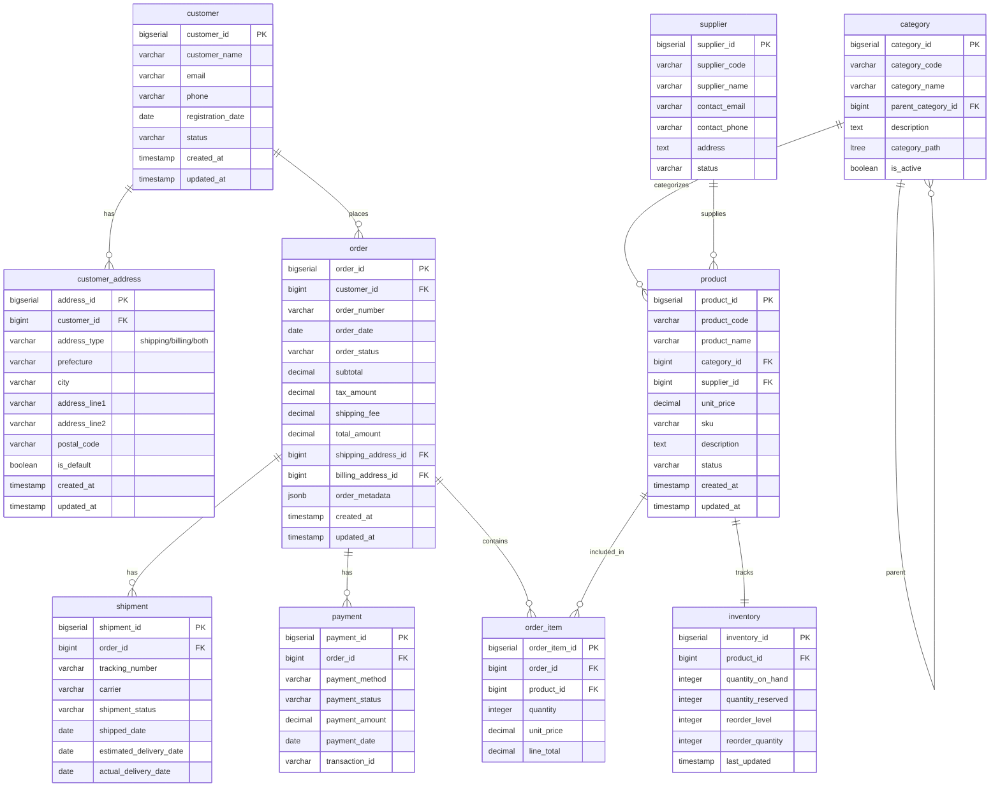

# 第4章 実践的データモデリング - ハンズオン環境

## 概要

本ハンズオンでは、EC サイト「ZakkaMall」の OLTP 業務システムから OLAP 分析システムへのデータ変換を実践します。急成長中の EC サイト企業「ZakkaMall」において、以下の課題を解決するためのデータマート構築プロジェクトを実施します。

- 複数ソースからのデータ統合の複雑さ
- 履歴管理と変更データの追跡
- パフォーマンスとメンテナンス性の両立

このハンズオンで扱う内容は次のとおりです。

- OLTP の正規化されたトランザクションデータを、分析に適したディメンショナルモデル（スタースキーマ）へ変換する
- dbt 公式ベストプラクティスの 3 層構造（staging / intermediate / marts）とマテリアライゼーション戦略（view / ephemeral / table）を使い分ける
- dbt snapshot による SCD Type 2 で履歴管理を実装し、「注文当時の属性」に基づく分析を可能にする
- 売上・商品・顧客・オペレーションの分析要件に対応する 5 つのマートを構築する（One Big Table 形式を含む）

各レイヤーの役割、プロジェクトのディレクトリ構成、構築するマートの一覧は末尾の「リファレンス」にまとめています。

## 前提条件

Docker（`docker compose` が実行できること）と uv のインストールは、[ハンズオン共通のセットアップ](../README.md#共通の前提条件)にまとめています。まだの場合は先に済ませてください。本ハンズオンでは AWS リソースは使いません。

本ハンズオンのコマンドはmacOS / Linuxのシェル（bash / zsh）とWindowsのPowerShellで動作します。

このハンズオンではデータベースに PostgreSQL 17 を利用します。業務システムと分析システムでは異なるデータベースを利用することも多いですが、このハンズオンでは 1 つのデータベース上に各レイヤーに対応するスキーマを用意することで区別するようにしています。

## 環境構築

### 1. Docker 環境の起動

```bash
cd chapter4

# Docker 環境の起動
docker compose up -d

# 起動確認
docker compose ps
```

スキーマとテーブルの準備は PostgreSQL docker イメージの[初期化スクリプト](https://hub.docker.com/_/postgres#initialization-scripts)の仕組みで自動的に行われます。

```
init-scripts/
├── 01_ddl.sql                    # テーブル定義（DDL）
├── 02_sample_data_master.sql     # マスタデータ（カテゴリ、仕入先、顧客、住所）
├── 03_sample_data_products.sql   # 商品データ（商品、在庫）
└── 04_sample_data_orders.sql     # 取引データ（注文、支払い、配送）
```

### 2. pgAdmin での確認（オプション）

ブラウザで http://localhost:8080 にアクセスして pgAdmin を開きテーブルの状態を確認できます。

- **Username**: dbt_user
- **Password**: dbt_password

### 3. dbt プロジェクトのセットアップ

```bash
cd dbt_project

# Python 仮想環境の作成と有効化
uv sync --frozen

source .venv/bin/activate  # macOS/Linux
# または
.venv\Scripts\activate     # Windows
```

> [!NOTE]
> `pyproject.toml` では dbt-core 1.11 系に対して dbt-postgres 1.10 系を指定しています。dbt-postgres などのアダプターは dbt-core 1.8 以降、dbt-core とは独立したバージョン体系でリリースされており、バージョン番号が一致している必要はありません。dbt-postgres 1.10 系は dbt-core 1.11 と互換性があります。

### 4. 接続確認とパッケージのインストール

```bash
# データベース接続の確認
dbt debug

# パッケージのインストール
dbt deps
```

## ハンズオンの実施

本文の節に対応させて Phase 1 から順に進めます。各 Phase の見出しに対応する本文の節名を併記しています。

### Phase 1: staging レイヤー（本文「stagingレイヤーの実装」）

OLTP の 10 テーブルのうち、分析要件で使う 9 テーブルに対応する staging モデルを view として構築します。

```bash
dbt run --select staging
```

`analytics_staging` スキーマに `stg_zakka_mall__customers` のような view が作られます。ソース名を挟んだダブルアンダースコア区切りの命名になっていることを確認してください。

なお、本ハンズオンのサンプルデータはクレンジング済みのため、staging モデルの `is_valid_record` は全件 `true` になります。品質違反の検出と対処は第 5 章「データ品質管理の実践」で扱います。

### Phase 2: intermediate レイヤー（本文「intermediateレイヤーの設計」）

intermediate の 4 モデルは `ephemeral` で定義しているため、実体テーブルを作りません。単体で実行しても対象にならないことを確認します。

```bash
dbt run --select intermediate
```

ephemeral モデルはマテリアライズの対象外なので、実行対象が 0 件になり、モデルの作成ログは出ません。実体を持たない代わりに、参照元のモデルへコンパイル時に CTE として展開されます。

```bash
dbt compile --select fct_orders
```

`target/compiled/zakkamall_analytics/models/marts/core/fct_orders.sql` を開くと、`int_orders_with_items`（明細集約）と `int_orders_with_payment_shipment`（支払い・配送）が `__dbt__cte__` というプレフィックス付きの with 句として埋め込まれていることが分かります。

### Phase 3: marts/core レイヤー（本文「ディメンショナルモデルの構築」）

`marts/core` は `base_dim_*` → `snapshot_dim_*` → `dim_*` → `fct_*` の 4 段構成です（各モデルの役割は末尾の「リファレンス」→「学習アーキテクチャ」を参照）。この依存関係の順にビルドします。

```bash
# 1. ディメンションの最新断面を作る（snapshot の入力）
dbt run --select base_dim_customers base_dim_products

# 2. SCD Type 2 の履歴テーブルを初期化する
dbt snapshot

# 3. snapshot を参照する dim と、dim をキーで結合する fct を構築する
dbt run --select marts.core
```

3 段階に分けているのは、`dim_customers` / `dim_products` が snapshot テーブルを参照しているためです。snapshot を初期化する前に dim をビルドしようとすると、参照先が存在せずエラーになります。「最新断面を作る → 履歴テーブルを初期化する → dim / fct を構築する」というこの順序が、SCD Type 2 実装の構造そのものです。

なお `dim_dates` を参照する relationships テストは分析マートの `order_processing` も対象に含むため、この時点では実行できません。テストは Phase 5 で分析マートを構築したあとにまとめて実行します。

### Phase 4: SCD Type 2 の動作確認（本文「SCD Type 2による履歴管理」）

`add_sample_data_changes` マクロでソースデータの変更を投入し、snapshot が履歴を記録する様子を確認します。

```bash
# 1. ソースデータの変更を投入
dbt run-operation add_sample_data_changes

# 2. base_dim を再ビルドして最新断面を更新
dbt run --select base_dim_customers base_dim_products

# 3. snapshot で履歴を記録（変更のあった行だけ新しいバージョンが追加される）
dbt snapshot

# 4. dim と fct を再ビルドして履歴を反映
dbt run --select marts.core
```

**履歴の確認（pgAdmin または psql）**

```sql
-- customer_id = 1 の属性履歴（2 バージョン）
SELECT customer_key, customer_id, customer_name, email, customer_status,
       valid_from::date AS valid_from, valid_to::date AS valid_to
FROM analytics_marts_core.dim_customers
WHERE customer_id = 1
ORDER BY valid_from;

-- 注文日に応じて当時の属性が結合されることを確認
-- マクロで追加した当日注文は新バージョン（変更後）と結合される
SELECT fo.order_id, fo.order_date, dc.customer_name, dc.email, dc.customer_status
FROM analytics_marts_core.fct_orders AS fo
INNER JOIN analytics_marts_core.dim_customers AS dc
    ON fo.customer_key = dc.customer_key
WHERE fo.customer_id = 1
ORDER BY fo.order_date;

-- product_id = 1 の価格改定履歴
SELECT product_key, product_name, unit_price, valid_from::date, valid_to::date
FROM analytics_marts_core.dim_products
WHERE product_id = 1
ORDER BY valid_from;
```

なお、マクロが追加した当日注文には価格改定後の `product_id = 1` が含まれます。Phase 5 で作る `sales_obt` では、この注文が改定後の単価、過去の注文が改定前の単価と結合されており、商品ディメンションでも期間マッチが働いていることが確認できます。

> [!NOTE]
> 本文が「現在有効な顧客情報を取得」する例として挙げている `WHERE valid_to > current_date` は、Phase 4 の直後に実行すると顧客 1 人につき 2 行返ります。`valid_to` は日付ではなくミリ秒精度のタイムスタンプで記録されるため、当日に閉じられた旧バージョンの `valid_to`（マクロの実行時刻）が `current_date`（当日 00:00）より大きくなり、旧バージョンも条件を満たしてしまうためです。現在有効なバージョンだけを取り出すには、`dbt_valid_to_current` で固定した値を直接指定する `WHERE valid_to = '9999-12-31'` か、時刻まで比較する `WHERE valid_to > current_timestamp` を使います。

> [!NOTE]
> マクロは実行日（未来日）の注文を追加するのに対し、`customer_analysis` の RFM 分析は `analysis_as_of_date`（既定 2024-12-31）を基準日に使うため、この注文を持つ顧客の `days_since_last_order` は負の値になります。基準日を固定して結果を安定させることの裏返しであり、実務では基準日をデータの最新日に合わせて運用します（`dbt run --vars '{analysis_as_of_date: 2026-12-31}'` のように上書きできます）。

### Phase 5: 分析マート（本文「データマートの構築とハンズオン実践」）

分析要件に対応する 5 つのマートを構築します。

- 売上系：`sales_summary`、`product_performance`、`sales_obt`
- マーケティング系：`customer_analysis`（RFM 分析）
- オペレーション系：`order_processing`（配送リードタイム、決済失敗率）

```bash
dbt run --select marts.sales marts.marketing marts.operations

# 全モデルのテストを実行する
dbt test
```

構築した売上系マートには、結果を読む際に押さえておきたい実装上の前提が 2 つあります。

**`sales_obt` の価格差分析**

`price_difference` / `price_change_percent` は、注文明細の単価と商品ディメンションの単価の差です。ディメンションは `product_key`（SCD Type 2 のサロゲートキー）で結合しているため、期間マッチが正しく効いていれば注文時点の単価同士の比較になり、差は 0 になります。期間マッチの整合性チェックとして読むカラムです。「現在の単価」と比較したい場合は、`dim_products` の現行バージョン（`valid_to = '9999-12-31'`）を別の CTE として `product_id` で結合します。

**`sales_summary` の前日比と移動平均**

`dim_dates` と売上を `inner join` しているため、売上のなかった日は行として存在しません。したがって `lag()` は「前日」ではなく「前回売上があった日」との比較になり、`rows between 6 preceding` の移動平均も「直近 7 暦日」ではなく「直近 7 売上日」の平均になります。暦日ベースで比較したい場合は `dim_dates` を `left join` して売上 0 の行を埋め、`rows` の代わりに `range between interval '6 days' preceding and current row` を使います。

### 一括実行と部分実行

各レイヤーの役割を確認できたら、以降の実行は `dbt build` にまとめられます。`dbt build` は snapshot を含めて依存関係の順に処理するため、モデルの構築とテストを 1 コマンドで回せます。

```bash
dbt build
```

`dbt build` は snapshot を DAG に含むので、環境構築直後の初回実行でも `base_dim_*` → `snapshot_dim_*` → `dim_*` → `fct_*` の順に処理され、1 コマンドで完了します。ここまで Phase を分けて実行してきたのは、各レイヤーの役割と依存関係を目で確認するためです。

特定のレイヤーだけを対象にする場合は `--select` で絞り込みます。

```bash
dbt run --select staging           # staging レイヤーのみ
dbt run --select intermediate      # intermediate レイヤーのみ（ephemeral のため実体は作られない）
dbt run --select marts             # marts レイヤー全体
dbt run --select marts.core        # marts/core（base_dim / dim / fct）のみ
dbt run --select marts.sales       # marts/sales 系マートのみ
dbt run --select marts.marketing   # marts/marketing 系マートのみ
dbt run --select marts.operations  # marts/operations 系マートのみ
dbt snapshot                       # SCD Type 2 の履歴テーブルの更新
```

## ドキュメントの生成と確認

```bash
# ドキュメント生成
dbt docs generate

# ドキュメントサーバー起動
dbt docs serve --host 0.0.0.0 --port 7070 --no-browser
```

ブラウザで http://localhost:7070 にアクセスして dbt プロジェクトのドキュメントを確認できます。

## SQL の lint（オプション）

本プロジェクトには [SQLFluff](https://docs.sqlfluff.com/) の設定（`.sqlfluff`）が含まれており、`pyproject.toml` の依存にも `sqlfluff-templater-dbt` が入っています。dbt テンプレート（`ref()` や `config()`）を解決してから lint するため、実行前に `dbt deps` を済ませておいてください。

```bash
# lint（models / snapshots / tests を対象にする）
sqlfluff lint models/ snapshots/ tests/

# 自動修正
sqlfluff fix models/ snapshots/ tests/
```

> [!NOTE]
> 本ハンズオンのモデルは lint をすべて通す状態にはしていません。たとえば `fct_orders.sql` の期間マッチ JOIN のインデントは本文の掲載形と揃えてあり、`sqlfluff fix` を実行すると本文と字面が変わります。`dim_dates` の `year` / `month` などの予約語カラム名、`is_valid_record` の `case` 式（`coalesce` に書き換えられる）も同様に本文の説明に合わせたものです。lint 設定は実務プロジェクトでの使い方を示すサンプルとして同梱しており、`.sqlfluff` の `exclude_rules` に自分のチームの方針を追記して使ってください。

## クリーンアップ

```bash
# dbt プロジェクトの初期化（target / dbt_packages / dbt_internal_packages / logs を削除）
dbt clean

# Python 仮想環境の無効化
deactivate

# docker 環境の削除
docker compose down -v --remove-orphans
```

> [!NOTE]
> `dbt clean` は `dbt_project.yml` の `clean-targets` に指定した `target/` / `dbt_packages/` / `dbt_internal_packages/` / `logs/` を削除します。実行ログも消えるため、ログを見返したい場合は先に退避してください。再開時は最初に `dbt deps` でパッケージを再インストールしてから `dbt run` / `dbt build` を実行してください。

## トラブルシューティング

**`dbt debug` が PostgreSQL に接続できない**

`docker compose ps` で `dbt_zakka_mall` コンテナが `healthy` になっているか確認してください。ポート 5432 が他プロセスで使われている場合は `compose.yml` のポートマッピングを変更するか、競合プロセスを停止します。

**`dbt run --select marts.core` が「relation does not exist」で失敗する**

`dim_customers` / `dim_products` は snapshot テーブルを参照するため、`dbt snapshot` を実行する前にビルドできません。Phase 3 の 3 段階（`base_dim_*` → `dbt snapshot` → `marts.core`）の順に実行してください。順序を気にせず 1 コマンドで済ませる場合は `dbt build` を使います。

**何度も実行して DB の状態が分からなくなった**

`add_sample_data_changes` マクロはソースデータに行を追加・更新するため、繰り返し実行すると Phase 4 の履歴が期待通りに読めなくなります。`docker compose down -v` でボリュームを削除して `docker compose up -d` で作り直すと、初期化スクリプトからクリーンな状態に戻ります。

## リファレンス

ハンズオンを進める際に参照する構成情報をまとめます。

### 学習アーキテクチャ

本ハンズオンでは、dbt 公式ベストプラクティスに沿った 3層構造を採用し、各レイヤーの役割の違いを段階的に体験できます。

- **staging**: ソースデータのクレンジング・標準化・命名統一
- **intermediate**: 再利用可能な変換ロジックを切り出す
- **marts**: ビジネスエンティティとしての分析対象
  - **core**: 横断的に参照されるスタースキーマ
  - **sales**: 売上系マート（sales_summary, product_performance, sales_obt）
  - **marketing**: マーケティング系マート（customer_analysis）
  - **operations**: オペレーション系マート（order_processing）

marts/core レイヤーではさらに以下の 4 段構成で SCD Type 2 を実装しています。

- `base_dim_*`（marts/core）: ディメンションの最新断面（snapshot の入力）
- `snapshot_dim_*`（snapshots/、YAML 形式）: SCD Type 2 の履歴管理
- `dim_*`（marts/core）: snapshot をビジネス向けにラップ（`customer_key` / `valid_from` / `valid_to` 等に命名を整える）
- `fct_*`（marts/core）: 注文日×有効期間の期間マッチ JOIN で、注文時点のディメンション属性と結合

### dbt プロジェクト構成

```
dbt_project/
├── models/
│   ├── staging/                                     # staging レイヤー（正規化・クレンジング）
│   │   └── zakka_mall/
│   │       ├── _zakka_mall__sources.yml             # ソース定義
│   │       ├── _zakka_mall__models.yml              # staging モデルのドキュメント・テスト
│   │       ├── stg_zakka_mall__customers.sql
│   │       ├── stg_zakka_mall__customer_addresses.sql
│   │       ├── stg_zakka_mall__products.sql
│   │       ├── stg_zakka_mall__categories.sql
│   │       ├── stg_zakka_mall__suppliers.sql
│   │       ├── stg_zakka_mall__orders.sql
│   │       ├── stg_zakka_mall__order_items.sql
│   │       ├── stg_zakka_mall__payments.sql
│   │       └── stg_zakka_mall__shipments.sql
│   ├── intermediate/                                # intermediate レイヤー（ephemeral）
│   │   ├── customers/
│   │   │   ├── _customers__models.yml               # intermediate モデル定義
│   │   │   └── int_customers_with_address.sql      # 顧客×デフォルト住所の結合
│   │   ├── products/
│   │   │   ├── _products__models.yml
│   │   │   └── int_products_with_category_and_supplier.sql  # 商品×カテゴリ×仕入先
│   │   ├── sales/
│   │   │   ├── _sales__models.yml
│   │   │   └── int_orders_with_items.sql           # 注文ヘッダー×明細の集約
│   │   └── operations/
│   │       ├── _operations__models.yml
│   │       └── int_orders_with_payment_shipment.sql # 注文×支払い×配送
│   └── marts/                                       # 分析用データマート
│       ├── core/                                    # スタースキーマの中核
│       │   ├── _core__models.yml                    # marts/core モデル定義
│       │   ├── base_dim_customers.sql               # 顧客の最新断面（snapshot 入力）
│       │   ├── base_dim_products.sql                # 商品の最新断面（snapshot 入力）
│       │   ├── dim_customers.sql                    # 顧客ディメンション（SCD Type 2 対応）
│       │   ├── dim_products.sql                     # 商品ディメンション（SCD Type 2 対応）
│       │   ├── dim_dates.sql                        # 日付ディメンション
│       │   ├── fct_orders.sql                       # 注文ファクト（注文粒度）
│       │   └── fct_order_items.sql                  # 注文明細ファクト（明細粒度）
│       ├── sales/                                   # 売上系マート
│       │   ├── _sales__models.yml
│       │   ├── sales_summary.sql
│       │   ├── product_performance.sql
│       │   └── sales_obt.sql
│       ├── marketing/                               # マーケティング系マート
│       │   ├── _marketing__models.yml
│       │   └── customer_analysis.sql
│       └── operations/                              # オペレーション系マート
│           ├── _operations__models.yml
│           └── order_processing.sql
├── snapshots/                                       # SCD Type 2 の履歴管理（v1.9+ YAML 形式）
│   └── snapshots.yml                                # snapshot_dim_customers / snapshot_dim_products
├── macros/
│   └── add_sample_data_changes.sql                  # サンプルデータ変更追加（ハンズオン用）
├── tests/
│   ├── business_rule_sales_amount_positive.sql      # sales_obt の total_amount が負でないことを検証
│   └── cross_table_order_subtotal_consistency.sql   # order.subtotal と sum(order_item.line_total) の整合性を検証
├── dbt_project.yml                                  # プロジェクト設定
├── profiles.yml                                     # データベース接続設定
├── packages.yml                                     # dbt パッケージ依存関係（dbt_utils のみ）
├── pyproject.toml                                   # Python 依存定義（dbt-core / dbt-postgres / sqlfluff）
└── .sqlfluff                                        # SQLFluff の lint 設定（オプション）
```

### 分析マートテーブル

| ディレクトリ | テーブル名 | 主な機能 | 分析内容 | 活用場面 |
| --- | --- | --- | --- | --- |
| core | **dim_customers** | 顧客ディメンション | 顧客属性・デフォルト住所 | スター結合の中核 |
| core | **dim_products** | 商品ディメンション | 商品属性・カテゴリ・仕入先 | スター結合の中核 |
| core | **dim_dates** | 日付ディメンション | 日付属性（曜日、月、四半期、年度） | 時系列分析の共通キー |
| core | **fct_orders** | 注文ファクト（注文粒度） | 注文ヘッダー + 明細集約 + 支払/配送サマリ | 注文単位の KPI |
| core | **fct_order_items** | 注文明細ファクト（明細粒度） | 明細単位の数量・金額 | 商品別の詳細分析 |
| sales | **sales_summary** | 売上サマリー | 日次売上サマリー・KPI ダッシュボード用 | 経営ダッシュボード、日次レポート |
| sales | **product_performance** | 商品パフォーマンス | 売上ランキング、商品別集計、ABC 分析 | 商品管理、在庫最適化 |
| sales | **sales_obt** | 包括的売上分析 | One Big Table 形式、セルフサービス分析対応 | BI ツール連携、アドホック分析 |
| marketing | **customer_analysis** | 顧客分析 | RFM 分析、顧客セグメンテーション | マーケティング戦略、ターゲティング |
| operations | **order_processing** | オペレーション分析 | 注文処理効率、配送リードタイム、決済失敗率 | 業務効率化、プロセス改善 |

## 実装詳細の補足

### vars によるパラメータ管理

日付ディメンションの生成範囲やビジネス分析のしきい値・基準日はハードコードするとメンテナンスしにくいため、`dbt_project.yml` の `vars` セクションで `start_date` / `end_date` / `analysis_as_of_date` / `high_value_customer_threshold` を定義しています。

- `dim_dates.sql` は `dbt_utils.date_spine` で `var('start_date')` / `var('end_date')` を参照し、日付ディメンションの生成範囲を決定します
- `customer_analysis.sql` の RFM 分析と `product_performance.sql` の商品ライフサイクル分類は、`var('analysis_as_of_date')`（既定 2024-12-31）を起点に「最終購買・最終販売からの経過日数」を数えます。`current_date` を使うと実行日によって分析結果が変わってしまうため、基準日を明示してサンプルデータの結果を安定させています。別の時点で分析したい場合は `dbt run --vars '{analysis_as_of_date: 2025-01-31}'` で上書きできます
- `customer_analysis.sql` の `customer_value_segment` は `var('high_value_customer_threshold')`（既定 100,000 円）以上を `High Value`、半額以上を `Medium Value`、それ未満を `Low Value` と分類します

一方、`stg_zakka_mall__customers` の `customer_tenure_segment`（登録日からの経過期間による顧客の区分）は `current_date` を基準にしているため、実行日によって分布が変わります。サンプルデータの `registration_date` は 2023-01〜2024-03 に集中しているので、現在はほぼ全件が `long_term` に寄ります。基準日に依存させたくない派生カラムは、このように `var('analysis_as_of_date')` へ寄せる設計も選択肢になります。

この構成により、vars を変更するだけで日付範囲やしきい値を調整でき、SQL 本体を書き換える必要がありません。実務では「過去データの取り込み範囲を拡張する」「本番・開発環境で異なる範囲を使う」「分析しきい値をビジネス側と合意した値に揃える」といった場面で活きるパターンです。vars はインクリメンタルモデルの基準日、ビジネスしきい値、データ品質基準など、プロジェクト全体で共有したいパラメータの定義場所として広く活用できます。

### snapshot timestamp 戦略と updated_at 自動更新トリガー

snapshot の `timestamp` 戦略は「ソース側で UPDATE のたびに `updated_at` が新しい値に書き換わる」前提で動きます。MySQL や MariaDB は `ON UPDATE CURRENT_TIMESTAMP` 句で簡単に実現できますが、PostgreSQL には同等の構文がないため `BEFORE UPDATE` トリガーで関数を発火させる方法を使います。

本ハンズオンでは `init-scripts/01_ddl.sql` で `update_updated_at_column()` 関数を定義し、`updated_at` を持つ 8 テーブル（`customer` / `customer_address` / `category` / `supplier` / `product` / `order` / `payment` / `shipment`）すべてに `BEFORE UPDATE` トリガーを仕込んでいます。このため `add_sample_data_changes` マクロ内の UPDATE 文に `updated_at = NOW()` を明示しなくても、トリガーが自動的に `updated_at` を更新し、snapshot の `timestamp` 戦略が差分を検知できます。実務でも、こうしたトリガーまたはアプリケーション層・ORM での自動更新が `timestamp` 戦略の前提条件になります（仕込めないソースに対しては `strategy: check` を検討してください）。

### 期間マッチ JOIN の境界ケース

fct_orders / fct_order_items の期間マッチ JOIN（`order_date >= valid_from::date AND order_date < valid_to::date`）に関する細かい境界ケースをまとめます。

#### 同日 2 回更新（複数バージョンが 1 日に発生）

たとえば顧客が 2024-03-15 09:00 に email を更新、同日 15:00 に customer_status を変更したケースでは、snapshot テーブルには次の行が並びます。

| customer_key | valid_from | valid_to |
|--------------|------------|----------|
| abc123 | 2023-01-15 | 2024-03-15 09:00 |
| def456 | 2024-03-15 09:00 | 2024-03-15 15:00 |
| ghi789 | 2024-03-15 15:00 | 9999-12-31 |

`valid_from` / `valid_to` はミリ秒精度のタイムスタンプで保持されているため、3 バージョンは互いに重ならず排他的に並びます。一方、本ハンズオンの JOIN 条件は `valid_from` / `valid_to` を `date` 型にキャストして比較するため、3 バージョンは次のように丸められます。

| customer_key | valid_from::date | valid_to::date |
|--------------|------------------|----------------|
| abc123 | 2023-01-15 | 2024-03-15 |
| def456 | 2024-03-15 | 2024-03-15 |
| ghi789 | 2024-03-15 | 9999-12-31 |

3 月 15 日の注文に対して、abc123 は `order_date < 2024-03-15` で除外、def456 は `order_date >= 2024-03-15 AND order_date < 2024-03-15` で除外（半開区間で同日は除外される）、ghi789 が JOIN されます。つまり同日に複数バージョンが発生した場合、その日の最終バージョンが選ばれる動作になります。日中に複数回属性が変わるソースでより正確に時点マッチを行いたい場合は、ファクト側の粒度をタイムスタンプ型に上げ、JOIN 条件から `::date` キャストを外して `order_timestamp >= valid_from AND order_timestamp < valid_to` のようにタイムスタンプ同士で比較するのが定石です。

#### 初回 snapshot 時の境界

`dbt snapshot` の初回実行時、各行は `valid_from = updated_at` で記録されます。したがって、ソース側の `updated_at` よりも前の日付を持つイベント（例: 注文日 `order_date` が顧客の `updated_at` より過去）はディメンションの有効期間にマッチせず、ファクト側でサロゲートキーが NULL になります。

本ハンズオンでは、サンプルデータの `customer.updated_at` を意図的に `registration_date`（2023-01〜2024-03）に揃えているため、注文日（2024 年〜）はすべて顧客の最古バージョンの `valid_from` 以降に収まり、初回 snapshot 時でも全注文が `customer_key` NULL にならず動作します。

実務でこの境界に当たる場合の対処法には次の選択肢があります。

- ファクト側でディメンションを `LEFT JOIN` してサロゲートキー欠落を許容する
- ソース側の `updated_at` を遡及的に過去へバックフィルする
- 履歴を持たない `dim_*_initial`（最古バージョンのみのスナップショット）を別途用意して欠落を補完する

#### dbt_valid_to_current を運用中の snapshot に後から追加した場合

`dbt_valid_to_current` は現在有効な行の `valid_to` に入れる値の設定です（デフォルトは NULL、本ハンズオンでは `9999-12-31` に固定）。運用中の snapshot テーブルに後からこの設定を追加した場合、dbt は既存行の `dbt_valid_to`（NULL）を自動では書き換えないため、全レコードの表現を統一するには手動での `UPDATE` が必要になります。

## 付録: OLTP データベーススキーマ詳細

以下の ER 図・テーブル仕様では、分析に使用しないカラム（UUID 型の外部 ID、JSONB 型の内部メタデータ、一部テーブルの created_at / updated_at 等）は省略している。完全なカラム定義は `init-scripts/01_ddl.sql` を参照。

### エンティティ関係図



### テーブル仕様詳細

#### 1. customer

顧客マスターテーブル。

| カラム | 型 | 説明 |
| --- | --- | --- |
| customer_id | bigserial | 主キー |
| customer_name | varchar | 顧客名 |
| email | varchar | メールアドレス |
| phone | varchar | 電話番号 |
| registration_date | date | 登録日 |
| status | varchar | ステータス（active / inactive 等） |
| created_at | timestamp | 作成日時 |
| updated_at | timestamp | 更新日時 |

#### 2. customer_address

顧客住所テーブル（1 顧客 N 住所の関係）。

| カラム | 型 | 説明 |
| --- | --- | --- |
| address_id | bigserial | 主キー |
| customer_id | bigint | 顧客 ID |
| address_type | enum | 住所種別（shipping / billing / both） |
| prefecture | varchar | 都道府県 |
| city | varchar | 市区町村 |
| address_line1 | varchar | 住所 1 |
| address_line2 | varchar | 住所 2 |
| postal_code | varchar | 郵便番号 |
| is_default | boolean | デフォルト住所フラグ |
| created_at | timestamp | 作成日時 |
| updated_at | timestamp | 更新日時 |

#### 3. category

商品カテゴリマスター（階層構造）。

| カラム | 型 | 説明 |
| --- | --- | --- |
| category_id | bigserial | 主キー |
| category_code | varchar | カテゴリコード |
| category_name | varchar | カテゴリ名 |
| parent_category_id | bigint | 親カテゴリ ID |
| description | text | カテゴリ説明 |
| category_path | ltree | カテゴリパス（階層構造） |
| is_active | boolean | 有効フラグ |

#### 4. supplier

仕入先マスター。

| カラム | 型 | 説明 |
| --- | --- | --- |
| supplier_id | bigserial | 主キー |
| supplier_code | varchar | 仕入先コード |
| supplier_name | varchar | 仕入先名 |
| contact_email | varchar | 担当者メール |
| contact_phone | varchar | 担当者電話 |
| address | text | 住所 |
| status | varchar | ステータス |

#### 5. product

商品マスター。

| カラム | 型 | 説明 |
| --- | --- | --- |
| product_id | bigserial | 主キー |
| product_code | varchar | 商品コード |
| product_name | varchar | 商品名 |
| category_id | bigint | カテゴリ ID |
| supplier_id | bigint | 仕入先 ID |
| unit_price | decimal | 単価 |
| sku | varchar | SKU |
| description | text | 商品説明 |
| status | varchar | 販売ステータス |
| created_at | timestamp | 作成日時 |
| updated_at | timestamp | 更新日時 |

#### 6. inventory

在庫情報。

| カラム | 型 | 説明 |
| --- | --- | --- |
| inventory_id | bigserial | 主キー |
| product_id | bigint | 商品 ID |
| quantity_on_hand | integer | 現在庫数 |
| quantity_reserved | integer | 引当在庫数 |
| reorder_level | integer | 発注点 |
| reorder_quantity | integer | 発注数量 |
| last_updated | timestamp | 最終更新日時 |

#### 7. order

注文トランザクション。

| カラム | 型 | 説明 |
| --- | --- | --- |
| order_id | bigserial | 主キー |
| customer_id | bigint | 顧客 ID |
| order_number | varchar | 注文番号 |
| order_date | date | 注文日 |
| order_status | varchar | 注文ステータス |
| subtotal | decimal | 小計 |
| tax_amount | decimal | 消費税額 |
| shipping_fee | decimal | 送料 |
| total_amount | decimal | 合計金額（生成列） |
| shipping_address_id | bigint | 配送先住所 ID |
| billing_address_id | bigint | 請求先住所 ID |
| order_metadata | jsonb | 注文メタデータ |
| created_at | timestamp | 作成日時 |
| updated_at | timestamp | 更新日時 |

#### 8. order_item

注文明細。

| カラム | 型 | 説明 |
| --- | --- | --- |
| order_item_id | bigserial | 主キー |
| order_id | bigint | 注文 ID |
| product_id | bigint | 商品 ID |
| quantity | integer | 数量 |
| unit_price | decimal | 明細単価 |
| line_total | decimal | 明細合計（生成列） |

#### 9. payment

支払いトランザクション。

| カラム | 型 | 説明 |
| --- | --- | --- |
| payment_id | bigserial | 主キー |
| order_id | bigint | 注文 ID |
| payment_method | varchar | 支払方法 |
| payment_status | varchar | 支払ステータス |
| payment_amount | decimal | 支払金額 |
| payment_date | date | 支払日 |
| transaction_id | varchar | 決済トランザクション ID |

#### 10. shipment

配送トランザクション。

| カラム | 型 | 説明 |
| --- | --- | --- |
| shipment_id | bigserial | 主キー |
| order_id | bigint | 注文 ID |
| tracking_number | varchar | 追跡番号 |
| carrier | varchar | 配送業者 |
| shipment_status | varchar | 配送ステータス |
| shipped_date | date | 発送日 |
| estimated_delivery_date | date | 配送予定日 |
| actual_delivery_date | date | 配送完了日 |
