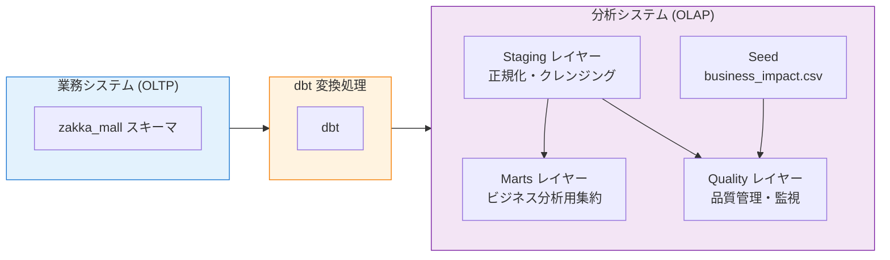
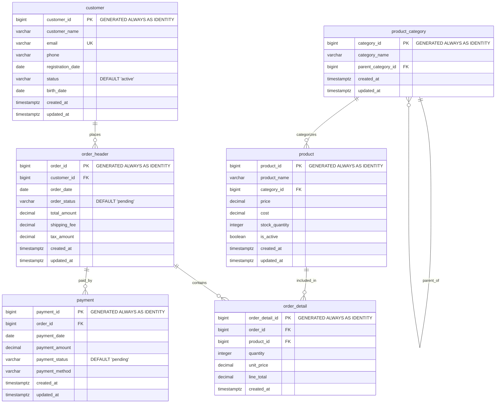

# 第5章：データ品質管理の実践 - ハンズオン環境

## 概要

このハンズオン環境は、dbt を使用したデータ品質管理の実践的な学習を目的としています。
意図的にデータ品質問題を含むサンプルデータを使用して、実際の現場で遭遇する品質課題への対処法を学習できます。

ZakkaMall という EC サイトを題材に、第5章の 4 つのシナリオに対応した形で品質評価・改善のプロセスを実装します。

1. **データ品質アセスメントと指標設計** — DMBOK2の4つの品質ディメンションで品質を定量化し、ビジネス影響度で改善の優先順位を決める
2. **開発段階での品質保証体制の構築** — unit test／generic data test／singular data testを組み合わせ、問題が本番に届く前に検出する
3. **運用段階での異常検知と監視** — Source Freshness・Elementary・snapshotで、想定外のデータパターンを検知する
4. **チーム間でのデータ品質情報共有** — dbt-osmosis／Exposure／dbt docsでメタデータを整備し、認識の齟齬を防ぐ

dbtプロジェクトは1つで、モデルやテストはシナリオ間で共有されます。ディレクトリがシナリオごとに分かれているわけではないため、以下では本書の読み進めに合わせて実行できるようPhase単位で手順を示します。各シナリオの実装内容の一覧は「リファレンス」節にまとめています。

---

## 前提条件

このハンズオンは **dbt v2（Rust エンジン、2.0.x）と DuckDB** で進めます。データベースは 1 ファイル（`dbt_demo.duckdb`）で完結するため、Docker は使いません。

### dbt v1（PostgreSQL）版との違い

書籍本文は dbt v1（Python 版 dbt Core）+ PostgreSQL を前提にしています。本ハンズオン資材は v2 + DuckDB 向けに書き換えてあり、主な差分は次のとおりです。

| 項目 | v1 版（書籍本文） | v2 版（本ハンズオン） |
| --- | --- | --- |
| dbt | dbt Core 1.11（Python パッケージ） | dbt v2 2.0.x（単一バイナリ） |
| データプラットフォーム | PostgreSQL 17（Docker） | DuckDB 1.5.5（`dbt_demo.duckdb` ファイル） |
| 必要なもの | Docker + uv | dbt v2 バイナリ + DuckDB CLI + uv |
| データの確認 | pgAdmin / psql | DuckDB CLI（`duckdb dbt_demo.duckdb`） |
| Lint | `sqlfluff lint` | 内蔵の `dbt lint` / `dbt format` |
| Elementary | そのまま動作 | `macros/elementary_duckdb_fusion.sql` の互換マクロが必要（後述） |
| Lightdash | ローカルの PostgreSQL に接続して実演 | ローカルの DuckDB ファイルには接続できないため実演しない（Exposure 生成のみ行う） |

dbt v2 のインストールは[公式ドキュメント](https://docs.getdbt.com/docs/install-dbt)、DuckDB CLI のインストールは [DuckDB 公式ドキュメント](https://duckdb.org/docs/installation/)を参照してください。uv のインストールは[ハンズオン共通のセットアップ](../README.md#共通の前提条件)にまとめています。本ハンズオンでは Python 3.12 以上を使い、AWS リソースは使いません。

> [!NOTE]
> 第4章と違い、この章では Python の仮想環境（uv）も必要です。Elementary のレポートを生成する `edr` と、メタデータを整備する `dbt-osmosis` が Python パッケージのためです。モデルのビルドは v2 バイナリ、レポートとメタデータ整備は `.venv` のツール、という二層構成になります。

本ハンズオンのコマンドはmacOS / Linuxのシェル（bash / zsh）とWindowsのPowerShellで動作します。

1 つのデータベースファイル上にレイヤーごとのスキーマを用意することで、業務システムと分析システムを区別しています。業務システムのソースデータは `zakka_mall`、dbt が生成するモデルは `analytics_staging` / `analytics_marts` / `analytics_quality` / `analytics_snapshots` に格納されます。加えて Elementary と dbt_project_evaluator がそれぞれ `analytics_elementary` / `analytics_dbt_project_evaluator` を作成し、テストの失敗レコードは `store_failures` の設定により `analytics_dbt_test__audit` に保存されます。

本章は第4章のディメンショナルモデリングを前提としています。第4章で構築したスタースキーマと同じ構成のマートに対してテストと品質監視を載せていく構成のため、先に第4章のハンズオンを済ませておくと理解しやすくなります。

## 環境構築

### 1. DuckDB データベースの作成

`duckdb-init/` の SQL を順番に流し込むと、ソーススキーマ `zakka_mall` と品質問題を含むサンプルデータが作成されます。

```bash
# chapter5 ディレクトリで実行
cat duckdb-init/*.sql | duckdb dbt_project/dbt_demo.duckdb
```

> [!NOTE]
> DuckDB はファイル名がカタログ名になるため、データベースファイル名は `dbt_demo.duckdb` にしています。ソース定義（`database: dbt_demo`）と揃えるためで、別の名前にすると参照できません。

投入結果は DuckDB CLI で確認できます。

```bash
cd dbt_project
duckdb dbt_demo.duckdb -c "
SELECT table_name, estimated_size FROM duckdb_tables()
WHERE schema_name = 'zakka_mall' ORDER BY table_name;
"
```

### 2. Python ツール（edr / dbt-osmosis）のセットアップ

```bash
# dbt_project ディレクトリで実行
uv sync --frozen

source .venv/bin/activate  # macOS/Linux
# または
.venv\Scripts\activate     # Windows
```

以降の `edr` / `dbt-osmosis` / `python utils/...` は、この仮想環境を有効にした状態で実行します。`dbt` コマンド自体は仮想環境とは無関係で、インストール済みの v2 バイナリが使われます。

`edr`（Elementary のレポート生成）は、内部で別ディレクトリの dbt プロジェクトを実行するため、データベースファイルを**絶対パス**で受け取る必要があります。`profiles.yml` の `elementary` プロファイルが環境変数 `CH5_DUCKDB_PATH` を参照しているので、これを設定しておきます。

```bash
# macOS / Linux
export CH5_DUCKDB_PATH="$(pwd)/dbt_demo.duckdb"
```

```powershell
# Windows (PowerShell)
$env:CH5_DUCKDB_PATH = "$(Get-Location)\dbt_demo.duckdb"
```

### 3. dbt パッケージのインストールと接続確認

```bash
# dbt パッケージのインストール
dbt deps

# データベース接続テスト
dbt debug
```

### 4. Elementary の互換マクロについて

`macros/elementary_duckdb_fusion.sql` には、Elementary を dbt v2 + DuckDB で動かすためのマクロが 4 つ入っています。dbt v2 は文ごとに別セッションで SQL を実行するため、Elementary が中間テーブルとして作る DuckDB の tempっっっｆ テーブル（セッションスコープ）が次の文から見えず、以下のエラーでビルドが失敗します。

```text
Catalog Error: Table with name dbt_models__tmp_<timestamp>... does not exist!
Parser Error: TEMPORARY table names can *only* use the "temp" catalog
```

Elementary は同じ問題を Redshift や Databricks では回避していますが、DuckDB 用の分岐がまだありません。そこで Redshift 向けと同じ方針（temp テーブルの代わりに通常テーブルを作る）を、`dbt_project.yml` の `dispatch` 設定と組み合わせてプロジェクト側から差し込んでいます。

```yaml
dispatch:
  - macro_namespace: elementary
    search_order: ["zakkamall_data_quality", "elementary"]
```

パッケージが未対応の組み合わせを `dispatch` とアダプタ別マクロで埋める実例としてそのまま残しています。Elementary 本体が DuckDB 用の分岐を取り込んだら、このファイルは削除できます。

---

## ハンズオンの実施

以下の Phase は第5章の各節に対応しています。本書を読み進めながら該当する Phase を実行してください。

### Phase 1: 環境の初期構築

`dbt build` で seed・モデル・テスト・snapshot を依存順に一括実行します。

```bash
# seed → モデル → テスト → snapshot を依存順に実行
# （Elementary や dbt_project_evaluator など依存パッケージのモデルも含まれる）
dbt build
```

**初回実行だけは Elementary のスキーマ監視テストが 5 件 error になります。** `elementary_source_schema_changes_*` はベースラインとの比較を行うため、比較対象のテーブル（`schema_columns_snapshot`）が未作成の 1 回目だけ失敗します。続けて `dbt build` をもう一度実行すると解消します。

```bash
# 2 回目の実行（Elementary のベースラインが作られた状態）
dbt build
```

2 回目以降のサマリは次のようになります。

```text
Processed: 3 hooks | 90 models | 204 tests | 2 snapshots | 2 seeds | 5 unit tests
Summary: 306 total | 245 success | 33 warn | 2 error | 26 skipped
```

**ERROR が 2 件出るのは意図的な設計です。** サンプルデータとテストに品質問題を仕込んでおり、これを段階的に解消する演習を後述の「ケーススタディ」で扱います。

エラーの下流にあたるモデル（`quality_assessment` / `quality_dashboard` など）は SKIP されるため、Phase 2 以降で結果を確認できるようにモデルだけを作っておきます。`dbt run` はテストを実行しないので SKIP が起きません。

```bash
# テストを経由せず全モデルを作成
dbt run
```

> [!NOTE]
> success / warn / total の件数は依存パッケージのバージョンや、Elementary が蓄積した学習データの状況によって前後します。ここで押さえるべきは **error が 2 件あり、その下流が skipped になっている**という構造です。参考として v1（dbt Core 1.11 + PostgreSQL）版では `PASS=245 WARN=32 ERROR=2 SKIP=32 NO-OP=1 TOTAL=312` でした。success 245 件と error 2 件は v2 + DuckDB でも一致します。

> [!NOTE]
> `dbt_project.yml` の `flags.require_explicit_package_overrides_for_builtin_materializations: false` は Elementary 連携の必須設定です。Elementary は built-in マテリアライゼーション（`view` / `table` / `incremental` 等）を上書きして内部のテーブル管理を行うため、この設定を外すと機能しません。dbt v2 でもこのフラグはそのまま有効です。

### Phase 2: データ品質アセスメント

DMBOK2 の 4 つの品質ディメンションによる評価結果と、ビジネス影響度マトリックスによる優先順位付けを確認します。モデルは Phase 1 で作成済みなので、ここでは結果を読み解きます。

```bash
# 品質評価の結果（スコアの低い順）
duckdb dbt_demo.duckdb -c "
SELECT table_name, column_name, quality_dimension, quality_score, quality_status
FROM analytics_quality.quality_assessment
ORDER BY quality_score
LIMIT 10;
"

# 統合ダッシュボード（品質スコアとビジネス影響度を突き合わせた改善優先度）
duckdb dbt_demo.duckdb -c "
SELECT table_name, overall_quality_score, business_impact, data_contamination, action_priority
FROM analytics_quality.quality_dashboard;
"
```

`action_priority` は品質スコアとビジネス影響度の組み合わせで決まります。品質が低くてもビジネス影響度が低ければ後回しにする、という判断を明示的にモデル化したものです。

dbt_project_evaluator によるプロジェクト構造の検査結果は、`dbt build` / `dbt run` の実行時に `on-run-end` フックで自動表示されます。

### Phase 3: 開発段階の品質保証

unit test・generic data test・singular data test は Phase 1 の `dbt build` で実行済みです。ここでは開発時に使う個別実行と、失敗内容の確認方法を押さえます。

#### unit test の単独実行

```bash
# 実データを参照せずロジックだけを検証するので高速に回せる
dbt test --select test_type:unit

# 最初の失敗で打ち切る（大量のテストを回すときに待ち時間を減らせる）
dbt test --fail-fast

# 本番運用では unit test を除外する（ロジック検証は CI で済んでいるため）
dbt build --exclude-resource-types unit_test
```

モデルのロジックを編集したときは、まず unit test だけを流して手戻りを早く検知します。`--fail-fast` は失敗を 1 件見つけた時点で打ち切るので、修正と再実行を短いサイクルで回したいときに向きます。逆に本番運用では `--exclude-resource-types unit_test` で unit test を除外し、実データに対する検証だけを走らせます。開発時・CI・本番運用でテストの範囲をどう変えるかは、本文「テスト戦略の体系化と実行計画」節で扱っています。

> [!NOTE]
> Phase 1 の `dbt build` では ERROR が 2 件でしたが、ここで `dbt test` を全件実行すると **ERROR は 3 件**になります。3 件目は `accepted_values_quality_assessment_quality_dimension` で、Phase 1 後半の `dbt run` で `quality_assessment` を作成したことにより実行可能になったものです（`dbt build` の時点では上流のエラーで SKIP されていました）。これは本文「テスト結果の分析と改善サイクル」の修正例 2 で扱う題材なので、後述の「ケーススタディ」で解消します。`--fail-fast` はテストの実行順によりこのテストで打ち切られることがあります。

#### 失敗内容の確認

`dbt_project.yml` で `store_failures: true` を設定しているため、失敗したテストの行は `analytics_dbt_test__audit` スキーマに保存されます。どのテストが何件失敗したかを行レベルで追えるので、原因の切り分けが速くなります。実際の確認方法は後述の「ケーススタディ」で扱います。

### Phase 4: 運用段階の異常検知と監視

Source Freshness と Elementary レポートは `dbt build` に含まれないため、個別に実行します。Elementary の異常検知テストは Phase 1 で実行済みです。

#### ソースデータの鮮度確認

```bash
# dbt build には含まれない独立したコマンド
# （source 経由で OLTP テーブルを直接見るためモデル生成は不要）
# v1 の `dbt source freshness` は v2 では `dbt freshness` に変わっている
dbt freshness

# 特定のソーステーブルだけを確認する（鮮度が落ちた対象を絞って調べるとき）
dbt freshness --select source:zakka_mall.order_header
```

Model Contracts は `contract: enforced: true` により `dbt run` / `dbt build` 時に自動検証されます。スキーマ変更の検知（Elementary の `schema_changes`）と運用監視テストも Phase 1 の `dbt build` に含まれています。

#### Snapshot の実行

```bash
# 変更履歴の記録（テストを経由しないので product_snapshot も作られる）
dbt snapshot
```

`dbt build` でも snapshot は実行されますが、テスト失敗の下流にあたる `product_snapshot` は SKIP されます。単独実行なら両方の履歴テーブルが作られます。

```bash
# 現在有効な行（dbt_valid_to_current を '9999-12-31' に設定しているため NULL ではない）
duckdb dbt_demo.duckdb -c "
SELECT customer_id, customer_name, dbt_valid_from, dbt_valid_to
FROM analytics_snapshots.customer_snapshot
WHERE dbt_valid_to = '9999-12-31'
LIMIT 5;
"
```

スキーマ名は `profiles.yml` の `target.schema`（`analytics`）と `snapshots.yml` の `config.schema`（`snapshots`）を連結した `analytics_snapshots` になります。

> [!NOTE]
> 本ハンズオンの `snapshots.yml` では `dbt_valid_to_current: "cast('9999-12-31' as timestamptz)"` のように明示キャストを記述しています。`'9999-12-31'` だけだと文字列リテラルと解釈され、`dbt_valid_to` カラム（`timestamptz` 型）と型不一致になりマテリアライズ時にエラーになるためです。dbt は YAML の値をそのまま SQL に埋め込むので、SQL エンジン側で型整合の取れる形（`cast('9999-12-31' as timestamptz)` 等）で書く必要があります。Snowflake や BigQuery は暗黙キャストが効きますが、移植性のため明示キャストが安全です。`updated_at` の型が `timestamp`（タイムゾーンなし）の場合は `cast('9999-12-31' as timestamp)` に揃えます。

#### Elementary レポートの生成

```bash
# 前提: Phase 1 の `dbt build` で Elementary モデルを作成済みであること
# 前提: 環境構築の手順 2 で CH5_DUCKDB_PATH を設定済みであること

# Elementary レポート生成
edr report --profiles-dir .
```

生成された `edr_target/elementary_report.html` をブラウザで開くとレポートを確認できます。

> [!IMPORTANT]
> `CH5_DUCKDB_PATH` を設定していないと、`Catalog Error: ... schema "analytics_elementary" does not exist` で失敗します。`edr` は自身に同梱された dbt プロジェクト（`.venv/lib/.../elementary/monitor/dbt_project`）を `--project-dir` にして dbt を実行するため、`path` が相対パスだとそのディレクトリ側に空のデータベースファイルを作ってしまうためです。

検知した異常をチームへ通知するには `edr monitor` を使います。本ハンズオンでは Slack ワークスペースを用意しないため実行しませんが、コマンドの形は次のとおりです。Incoming Webhook の URL を渡すと、Elementary が検知した異常が Slack に投稿されます。

```bash
# 検知した異常を Slack に通知する（要 Incoming Webhook）
edr monitor --slack-webhook https://hooks.slack.com/services/XXX/YYY/ZZZ
```

### Phase 5: メタデータのチーム共有

dbt-osmosis で YAML のメタデータを整備します。Exposure による利用先の宣言と dbt docs でのチーム共有は後続の節で扱います。

```bash
# 定義済みの Exposure を一覧する
# （v2 の --resource-type に exposure は無いため、セレクタで絞り込む）
dbt ls --select "exposure:*"

# 特定のダッシュボードが依存するモデルをまとめて再構築する
dbt run --select +exposure:executive_dashboard
```

`+exposure:executive_dashboard` は「このダッシュボードが参照しているモデルとその上流すべて」を指すセレクタです。BI 側で数値が合わないときに、関係するモデルだけを絞って再構築できます。

#### dbt-osmosis によるメタデータの自動生成

`dbt-osmosis` は上流モデルの `description` を下流の YAML へ伝播させ、データウェアハウスから取得した `data_type` を補完し、`dbt_project.yml` の `+meta.dbt-osmosis` 設定に従って YAML の構成を整えるツールです。

```bash
# 差分の確認のみ（変更は書き込まない）
dbt-osmosis yaml refactor --dry-run --check --skip-add-data-types --skip-add-columns --skip-add-source-columns

# 実行
dbt-osmosis yaml refactor --skip-add-data-types --skip-add-columns --skip-add-source-columns
```

3 つのフラグを付けているのは、本ハンズオンが型定義を手動管理しているためです。**これらを外して実行すると YAML が意図せず書き換わります。**

- `--skip-add-data-types`: 情報スキーマが返す正式名（`varchar` → `character varying`、`timestamptz` → `timestamp with time zone`）への書き換えを抑制します。本書の marts では `contract: enforced: true` と `alias_types: false` を設定し、本文の解説どおり `varchar` / `timestamptz` と明示しているため、この書き換えは避ける必要があります。付けずに実行すると `numeric(15, 2)` のような精度指定も `numeric` に退化します
- `--skip-add-columns` / `--skip-add-source-columns`: データウェアハウスに存在するカラムを YAML へ自動追加する動作を抑制します

初期状態は上記フラグ付きで `--dry-run --check` が exit 0（差分なし）になるよう整えてあります。伝播の挙動は次の手順で確認できます。

**演習: description の自動伝播を確認する**

1. `models/marts/_dim_customers.yml` の `customer_name` の `description` を空にします。

```yaml
      - name: customer_name
        description: ""
```

2. 差分が検知されることを確認します（exit code が 1 になります）。

```bash
dbt-osmosis yaml refactor --fqn marts --dry-run --check --skip-add-data-types --skip-add-columns --skip-add-source-columns
```

3. 実行します。

```bash
dbt-osmosis yaml refactor --fqn marts --skip-add-data-types --skip-add-columns --skip-add-source-columns
```

4. `models/marts/_dim_customers.yml` をエディタで開き、`customer_name` の `description` が復元されていることを確認します。

`dim_customers` の上流にあたる `stg_zakka_mall__customers` の同名カラムから `顧客名` が伝播します。同じカラムの説明を staging と marts の両方に書く必要がなくなる、というのがこの機能の要点です。`dim_customers` の 14 カラムのうち 8 カラムが staging に同名で存在するため、他のカラムでも同じ挙動を確認できます。

なお `age` は staging 側が「年齢（計算項目）」、marts 側が「年齢」と異なる説明を持ちますが、dbt-osmosis は既存の値を上書きしないため marts の記述がそのまま維持されます。伝播は「空の場合に上流から補う」動作です。

演習後はステップ 3 の実行によって初期状態に戻っているため、`git checkout` は不要です。

---

### ケーススタディ: dbt build のエラーを段階的に解消する

シナリオ 2・3 で整備したテスト群を実際に `dbt build` で回すと、いくつかのエラーに遭遇します。ここでは実際に発生するエラーを段階的に解消していき、`fail 0 / skip 0` の状態に到達するまでの手順を示します。本書のサンプルリポジトリは `severity: warn` の適切な設計を既に施した状態がスタート地点となっており、読者はその状態から **個別テストの記述誤り** と **意図的な異常データ** という 2 種類の課題に取り組みます。

本書との対応関係は以下の通りです。開発時 (`dbt test`) に発見する個別テストの記述誤りは本文の「テスト結果の分析と改善サイクル」節で、運用統合時 (`dbt build`) に顕在化する全体整合性の問題は「ケーススタディ：dbt buildのエラーを段階的に解消する」節で扱っています。ハンズオンでは両方を通して体験できるように全 3 サイクル + severity 設計の確認パートを順に進めます。

- **初回 build: 現状把握** と **severity 設計の確認**: 本文「ケーススタディ：dbt buildのエラーを段階的に解消する」節を参照
- **サイクル A: 単位不整合の修正** (profit_margin): 本文「テスト結果の分析と改善サイクル」節の修正例 1 を参照
- **サイクル B: 意図的な異常データを運用フローで処理** (operational_monitoring 等): 本文「運用監視とアラート配信の実践」および「dbt docsを中心としたメタデータハブと改善タスク管理」節を参照
- **サイクル C: ビジネスキー重複の修正** (test_unique_combination): 本文「generic data testによる体系的データ検証」節を参照

#### 初回 build: 現状把握

Phase 1 で実行した `dbt build` の結果を振り返ります。

```text
Done. PASS=245 WARN=32 ERROR=2 SKIP=32 NO-OP=1 TOTAL=312
```

内訳:

- **PASS 245**: モデル・テスト・unit test・snapshot・seed・operation の成功分
- **WARN 32**: severity=warn に設定したテスト群 (後述の severity 設計参照)
- **ERROR 2**: 個別テストの記述誤り (profit_margin 単位不整合) と意図的な重複データ (ノート A4 無地) に起因する fail。この 2 件がサイクル A・C で扱う課題
- **SKIP 32**: fail のあるモデル `stg_zakka_mall__products` に依存する下流が skip 連鎖

失敗テストの内訳は Elementary のテーブルから SQL で抽出できます。Elementary は `dbt build` / `dbt test` の実行結果を自動的に `elementary_test_results` テーブルに蓄積するため、運用時に継続的にモニタリングするのに適しています。

```bash
duckdb dbt_demo.duckdb -c "
SELECT test_name, status, failures
FROM analytics_elementary.elementary_test_results
WHERE status IN ('fail', 'error')
  AND invocation_id = (
    SELECT invocation_id FROM analytics_elementary.dbt_invocations
    ORDER BY run_started_at DESC LIMIT 1
  )
ORDER BY failures DESC;
"
```

または `edr report` で生成される HTML レポートから GUI で追跡することも可能です。

```bash
edr report --profiles-dir .
```

`stg_zakka_mall__products` に対する 2 件の fail が抽出できます。このモデルと下流 (products mart・quality 配下のダッシュボード群) が skip されているわけです。

意図的に severity=warn に設計されたテスト群は warn として実行されており、build を止めることなくダッシュボードから検知結果を確認できる状態になっています。これは本節最後に改めて取り上げます。

#### サイクル A: 単位不整合のロジックバグを修正する

> 本文対応: 開発時に `dbt test` で発見すべき個別テストの記述誤りで、**本文「テスト結果の分析と改善サイクル」節の修正例 1** で詳しく扱っています。

`business_rule_product_profit_margin_calculation` が CALCULATION_ERROR を出しています。

**失敗内容の確認**: `store_failures` で保存された audit テーブルから、実際の失敗行を DuckDB CLI で確認します。

```bash
duckdb dbt_demo.duckdb -c "
SELECT product_id, product_name, price, cost,
       recorded_profit_margin, calculated_profit_margin, validation_status
FROM analytics_dbt_test__audit.business_rule_product_profit_margin_calculation
LIMIT 5;
"
```

**原因**: 記録された profit_margin は 50.00（パーセント表記）だが、テスト内の比較計算は 0.500（小数表記）で算出している。同じ「50%」を表しているのに単位が異なるためテストが FAIL する。

**修正**: stg モデルは既にパーセント表記（`* 100`）で算出されているので、テスト側の比較式を同じ単位に揃えます。テストの合否を決めるのは `where` 句なので、ここを直せば PASS します。

```sql
 where
     (
         (price = 0 and profit_margin != -100.0)
         or
-        -- 通常商品で計算結果と記録値に差異がある場合（0.1%以上の差）
-        (price > 0 and abs(profit_margin - round((price - cost)::decimal / price::decimal, 3)) > 0.001)
+        -- 通常商品: 計算式を百分率に揃える（`* 100` を追加し、丸め桁と閾値も調整）
+        (price > 0 and abs(profit_margin - round(((price - cost) / price * 100)::decimal, 2)) > 0.01)
     )
```

同じ計算式は select 句の `calculated_profit_margin` と `validation_status` にも現れます。こちらは合否に影響しませんが、直さないと audit テーブルに小数表記（`0.500`）が残って原因を追いにくくなるため、あわせて揃えておくとよいです。

修正したら再実行します。`dbt build` を最初から流し直してもかまいませんが、`dbt retry` を使うと前回の実行結果（`target/run_results.json`）を読んで失敗したノードから再開するため、修正の効果を早く確認できます。

```bash
# 前回失敗したノードとその下流だけを再実行する
dbt retry
```

#### サイクル B: 運用フローで意図的な異常を処理する

> 本文対応: **本文「運用監視とアラート配信の実践」および「dbt docsを中心としたメタデータハブと改善タスク管理」節** で扱う運用フローの題材です。テスト FAIL を修正する対象としてではなく、運用プロセスで発見・対応する対象として扱います。

初回 build で見られた warn のうち、意図的に混入させた異常データに由来するものを確認します。代表例として `operational_monitoring` を見てみましょう。

```bash
duckdb dbt_demo.duckdb -c "
SELECT issue_type, detail, metric_value, severity
FROM analytics_dbt_test__audit.operational_monitoring;
"
```

出力例:

```text
 issue_type              | detail                   | metric_value | severity
-------------------------+--------------------------+--------------+----------
 BUSINESS_RULE_VIOLATION | negative_amounts         |            1 | CRITICAL
 BUSINESS_RULE_VIOLATION | future_orders            |            1 | CRITICAL
 BUSINESS_RULE_VIOLATION | payment_amount_mismatch  |            2 | CRITICAL
```

これらは **ZakkaMall のサンプルデータに意図的に混入させた異常値** で、異常検知ダッシュボードが検知すべき典型例として設計されています。したがってテスト自体を修正してパスさせるのではなく、運用プロセス側で対応します。

**対応方針**:

1. severity=warn に設定されているため build は止まっていない
2. Elementary の `elementary_test_results` テーブルに検知結果が蓄積される (`edr report` で HTML 化、または BI ツールで直接参照)
3. ビジネス担当者と連携してソースデータ側で修正するワークフローを確立

同じ warn のうち、統計的な異常検知として発火するものも確認しておきます。`seasonal_business_patterns` は月次売上の Z スコアで季節性の異常を検知するテストです。

```bash
duckdb dbt_demo.duckdb -c "
SELECT current_month, current_sales, avg_monthly_sales, round(z_score, 2) AS z_score, anomaly_type
FROM analytics_dbt_test__audit.seasonal_business_patterns;
"
```

出力例（実行月によって値は変わります）。

```text
 current_month | current_sales | avg_monthly_sales | z_score |    anomaly_type
---------------+---------------+-------------------+---------+---------------------
             8 |      18500.00 |         155000.00 |  -13.79 | unusually_low_sales
```

ZakkaMall はこの月に毎年夏のセールを実施しており、過去 2 年は月商 15 万円前後で安定していました。当月の売上がその水準を大きく下回っているため、`unusually_low_sales` として検知されています。売上の急減はデータ連携の失敗（注文データの取り込み漏れ）でも起こるため、ビジネス上の実態なのかパイプラインの障害なのかを切り分ける必要がある、という判断材料になります。

**学び**: テストが warn で検知されることは必ずしも悪ではなく、「異常を発見して対処フローに載せる」という運用段階のテストの本来の役割が果たせている状態です。

#### サイクル C: ビジネスキーの重複データを修正する

> 本文対応: custom generic test の題材で、**本文「generic data testによる体系的データ検証」節** の `test_unique_combination` に該当します。ID だけでなくビジネスキー (商品名 + カテゴリ) の unique を検証することで、primary key の unique では捕まえられない業務ルール違反を発見します。

残る `test_unique_combination_stg_zakka_mall__products_product_name__category_id` の 1 件を解消します。これは custom generic test で、「商品名 + カテゴリ ID の組み合わせ」がユニークであることを検証しています。

**重複内容の確認**: 以下の SQL を実行します。

```bash
duckdb dbt_demo.duckdb -c "
SELECT product_name, category_id, count(*), array_agg(product_id)
FROM analytics_staging.stg_zakka_mall__products
GROUP BY 1, 2 HAVING count(*) > 1;
"
```

結果:

```text
 product_name   | category_id | count | array_agg
----------------+-------------+-------+-----------
 ノート A4 無地   |          14 |     2 | {10, 11}
```

「ノート A4 無地」が category_id=14 に 2 件登録されています。これは商品マスタへの二重登録による業務ルール違反で、ID（product_id）は異なるため primary key の unique では検知できません。custom generic test が **ビジネスキーの unique 違反** を発見したことで可視化されました。

**修正 (2 つのアプローチから選択)**:

- **アプローチ A: ソース側の修正** — `zakka_mall.product` テーブルから重複の片方を削除する。マスタデータの正規化として最も健全

```bash
# duckdb-init 配下のシード SQL を編集して product_id=11（重複側）を削除するか、
# 既に起動している DB に対して直接削除する
duckdb dbt_demo.duckdb -c "
DELETE FROM zakka_mall.product WHERE product_id = 11;
"
```

- **アプローチ B: stg モデルで排除** — ソースを変更できない場合、stg モデルで `QUALIFY` 相当の処理で最新の 1 行に絞り込む

```sql
-- models/staging/zakka_mall/stg_zakka_mall__products.sql に追加
with deduplicated as (
    select *, row_number() over (
        partition by product_name, category_id
        order by updated_at desc, product_id
    ) as rn
    from source
)
select * from deduplicated where rn = 1
```

**再実行と最終確認**:

```bash
dbt build
```

サイクル A・C と、本文「テスト結果の分析と改善サイクル」節の修正例 2 (`quality_assessment` の `accepted_values` に `consistency` を追加) をすべて適用すると、サマリは次のように推移します。

| 段階 | PASS | WARN | ERROR | SKIP |
| --- | --- | --- | --- | --- |
| 初回 build | 245 | 32 | 2 | 32 |
| サイクル A 適用後 | 244 | 34 | 1 | 32 |
| サイクル C 適用後 | 264 | 34 | 1 | 9 |
| 修正例 2 適用後 | 272 | 34 | **0** | **0** |

サイクル C を解消すると skip 連鎖が解けて `quality_assessment` モデルが実行されるため、修正例 2 に対応する fail (accepted_values に `consistency` が含まれていない) が新たに顕在化します。この時点では SKIP が 9 件残り、修正例 2 まで適用して `ERROR=0 / SKIP=0` に到達します。

**ERROR が減っても WARN は残り続ける**点にも注目してください。severity=warn に設計した運用フェーズのテスト群が「異常を検知するが build は止めない」という意図どおりに動いています。初回の 32 件から 34 件に増えているのは、Elementary が過去の実行結果を学習データとして蓄積するため、2 回目以降の build で `dimension_anomalies` が 2 件（`stg_zakka_mall__orders` の `order_status`、`stg_zakka_mall__payments` の `payment_status` / `payment_method`）検知に加わるからです。

上の表は各サイクルを適用して 1 回 build した実測値です。PASS と WARN は Elementary の学習データの蓄積状況で前後するので、件数そのものではなく **ERROR が 2 → 1 → 0 と減り、SKIP の連鎖が 32 → 9 → 0 と解けていく流れ**を追ってください。

#### severity 設計: なぜこの初期状態になっているか

本書のサンプルリポジトリは、初回 build でいくつかの fail とその下流 skip が発生する「適度に整った状態」から始まりますが、これは意図的な設計です。
原因は、ソース (`order_header`) に紐づく severity=error のテスト群が FAIL すると、そのソースを使うモデル (stg_zakka_mall__orders) と、それに依存する mart・quality 配下のモデル群がすべて skip される挙動でした。本ハンズオンではこの skip 連鎖を最小化するため、運用フェーズの統計的異常検知系テストを `severity: warn` に設計変更しています。なお、 severity=error 起点の skip 連鎖は、サイクル C で扱う `stg_zakka_mall__products` の custom generic test `test_unique_combination` に絞り込まれています。

この問題を解消するため、以下の 6 つのテストを `severity: warn` に設計変更しました。

```sql
-- 以下のテストファイルの冒頭に追加済み
{{ config(severity='warn') }}
```

対象ファイル:

- `tests/operations/advanced_anomaly_detection.sql` (統計的外れ値・鮮度・季節性の異常検知)
- `tests/operations/operational_monitoring.sql` (ボリューム・鮮度・ビジネスルール違反の包括監視)
- `tests/cross_table_order_payment_amount_consistency.sql` (注文・支払い金額の整合性)
- `tests/advanced_business_rules.sql` (複数テーブル間の高度なビジネスルール)
- `tests/anomaly_orders_during_night_hours.sql` (深夜時間帯の注文比率異常検知)
- `tests/seasonal_business_patterns.sql` (月次売上の Z スコアによる季節性異常検知)

これらはいずれも「統計的異常」または「意図的に混入された異常データの検知」が目的のテストで、build を止めるべき性質のものではありません。検知結果はサイクル B で確認したように Elementary の `elementary_test_results` テーブルに蓄積され、`edr report` または BI ツールで可視化して運用担当者が判断するフローに乗せます。

**severity 設計の指針**:

- `severity: error`: not_null・unique・参照整合性など、違反があればパイプラインを止めてでも対処すべきテスト
- `severity: warn`: 統計的な異常検知、業務データに由来する想定内の異常、意図的に検知対象として残したい異常データ

この設計判断によって、skip 連鎖がソース起点の広範なものから、`stg_zakka_mall__products` 起点の局所的なものに絞り込まれています。

## ドキュメントの生成と確認

```bash
# ドキュメント生成
dbt docs generate

# ドキュメントサーバー起動（http://localhost:7072）
# v1 の --no-browser は v2 では --no-open（v2 の既定ポートは 8580）
dbt docs serve --host 0.0.0.0 --port 7072 --no-open

# Exposures の確認
# http://localhost:7072 の右下パネル「Exposures」で 6 件（exposures.yml の 5 件 + exposures_from_lightdash.yml の 1 件）を確認
```

## SQL の lint（オプション）

dbt v2 には SQLFluff 互換のリンタとフォーマッタが内蔵されています。設定は従来どおり `.sqlfluff` を読むため（本プロジェクトでは `dialect = duckdb`）、追加のインストールは不要です。dbt テンプレート（`ref()` や `config()`）を解決してから lint するため、実行前に `dbt deps` を済ませておいてください。

```bash
# lint（models / snapshots / tests / macros / seeds を対象にする）
dbt lint

# 自動整形
dbt format
```

初期状態では 1 件の error（`stg_zakka_mall__products.sql` の `else null` / ST01）と 7 件の warning（RF02 / RF04 / ST06）が報告されます。`dbt format` を実行すると `tests/advanced_business_rules.sql` と `tests/seasonal_business_patterns.sql` の `case` / `where` のインデントが本文の掲載形から変わるため、そのまま実行せずに差分を確認してください。

> [!NOTE]
> 本ハンズオンのモデルとテストは lint をすべて通す状態にはしていません。第5章は singular data test やカスタムマクロが多く、そのうちいくつかは本文にコード例として掲載しているため、`dbt format` や `dbt lint --fix` を実行すると本文と字面が変わってしまいます。たとえば `tests/operations/advanced_anomaly_detection.sql` のインデント（LT02）は本文の掲載形に揃えたものです。`tests/anomaly_orders_during_night_hours.sql` の `total_count` を修飾しない参照（RF02）はサブクエリの読みやすさを優先した書き方、`stg_zakka_mall__products.sql` の `else null`（ST01）は分岐の意図を明示するために残しています。`tests/advanced_business_rules.sql` の `case` 式のインデント（LT02）と `tests/seasonal_business_patterns.sql` の `year` / `month` というカラム名（RF04）も同様に、可読性と本文の掲載形を優先して残したものです。lint 設定は実務プロジェクトでの使い方を示すサンプルとして同梱しており、`.sqlfluff` の `exclude_rules` に自分のチームの方針を追記して使ってください。

---

## [Advanced] Lightdash を利用した BI ダッシュボードによる可視化

書籍本文ではこの節で Lightdash（BI ツール）を起動し、dbt モデルをダッシュボードとして可視化します（シナリオ4）。**dbt v2 + DuckDB 版では Lightdash の実演は行いません。**

> [!IMPORTANT]
> Lightdash が対応する DuckDB は **MotherDuck（クラウド）** と **DuckLake（カタログ + オブジェクトストレージ）** の 2 モードだけで、ローカルの単一ファイル（`dbt_demo.duckdb`）に接続する構成がありません。加えて Lightdash 本体は Docker コンテナで動くためファイルパスの共有が必要で、DuckDB の「1 プロセスしか書き込めない」制約とも衝突します。Lightdash の実機手順を試したい場合は、v1（dbt Core + PostgreSQL）版のハンズオン資材を使ってください。

代わりに、**Lightdash からダウンロード済みのダッシュボード定義を使って dbt Exposure を生成する手順**を実行します。`lightdash/` ディレクトリに Lightdash の `download` 結果（チャート 3 件 + ダッシュボード 1 件の YAML）をコミットしてあるため、Lightdash を起動しなくても以降の手順はそのまま動きます。

```text
dbt_project/lightdash/
├── charts/                          # チャート定義（Lightdash download の出力）
├── dashboards/
│   └── dbt-book-demo-dashboard.yml  # ダッシュボード定義
└── shared.space.yml
```

「BI ツール側の利用実態を dbt の Exposure としてコード化する」という本節の学習目標は、次の 2 つの手順で確認できます。

#### ダウンロードしたダッシュボードから dbt Exposure を生成

Lightdash からダウンロードしたダッシュボードとチャートの定義から、dbt Exposure を自動生成できます（シナリオ4）。

```bash
python utils/generate_exposures_from_lightdash.py --lightdash-dir lightdash
```

これにより `models/exposures_from_lightdash.yml` が生成され、Lightdash ダッシュボードと dbt モデルの依存関係が可視化されます。

生成された exposure は以下で確認できます。

```bash
dbt docs generate
dbt docs serve
# http://localhost:7072 の右下パネル「Exposures」で確認
```

#### sql_parser.py による参照テーブルの抽出

`utils/sql_parser.py` は、 SQL の `from` 句からテーブルやビューを抜き出し、CTE やサブクエリの別名は結果から除きます。Lightdash のように参照先を構造化フィールドで持たず、SQL しか手がかりがない BI ツールで依存関係を割り出したいときの参考になります。

テーブル名を正規表現で拾おうとすると、CTE やサブクエリの別名まで巻き込んでしまいます。`sql_parser.py` は Python 製の SQL パーサー [sqlglot](https://github.com/tobymao/sqlglot) を使い、SQL を AST（抽象構文木）に変換してから、CTE やサブクエリを構文として判別して除外します。正規表現よりも取りこぼしや誤検出が起きにくい方法です。

対象にするのはコンパイル済みの SQL です。`ref()` や `source()` が実際のスキーマ修飾名に展開されているため、そのまま解析できます。先に `dbt compile` を実行しておきます。

```bash
# コンパイル済み SQL を生成（未実行の場合）
dbt compile --select dim_customers

# FROM 句から実テーブルを抽出（dbt_project ディレクトリで実行）
python utils/sql_parser.py target/compiled/zakkamall_data_quality/models/marts/dim_customers.sql
```

`dim_customers` は `customers`、`orders`、`payments`、`customer_orders`、`customer_payments`、`final` という 6 つの CTE を含みます。これらはすべて除外され、実際に参照している staging の 3 テーブルだけが残ります。

```
"dbt_demo"."analytics_staging"."stg_zakka_mall__customers"
"dbt_demo"."analytics_staging"."stg_zakka_mall__orders"
"dbt_demo"."analytics_staging"."stg_zakka_mall__payments"
```

`--verbose`（`-v`）を付けると、除外した CTE 名や参照テーブル数を標準エラー出力に表示します。抽出結果が想定と合わないときの確認に使えます。

```bash
python utils/sql_parser.py target/compiled/zakkamall_data_quality/models/marts/dim_customers.sql --verbose
```

本文シナリオ4では「BI ツールが発行する SQL を静的解析して `depends_on` を割り出す」アプローチを紹介しました。`sql_parser.py` はその考え方を小さく試せる形にしたものです。Lightdash では構造化フィールドから直接生成できますが、SQL しか得られない BI ツールでは、この抽出処理が依存関係の割り出しに役立ちます。

---

## クリーンアップ

ハンズオンを終えたら、次の手順で環境を片付けます。

### dbt の生成物を削除

```bash
cd dbt_project
dbt clean
```

`dbt_project.yml` の `clean-targets` には次の 5 パスを指定しています。`logs/` と `edr_target/` も削除対象なので、実行ログや Elementary のレポートを見返したい場合は先に退避してください。

| パス | 内容 |
| --- | --- |
| `target/` | コンパイル結果、`manifest.json`、`run_results.json` |
| `edr_target/` | Elementary の HTML レポート（`edr report` の出力先） |
| `dbt_packages/` | `dbt deps` で導入したパッケージ |
| `dbt_internal_packages/` | dbt 内部のパッケージ |
| `logs/` | dbt の実行ログ（`dbt.log`） |

再開するときは `dbt deps` でパッケージを再インストールしてから `dbt run` / `dbt build` を実行します。

### 仮想環境から抜ける

```bash
deactivate
```

`.venv/` ごと削除する場合は `rm -rf .venv` を実行します。再開時は `uv sync --frozen` で作り直せます。

### データベースファイルを削除

```bash
# dbt_project ディレクトリで実行
rm dbt_demo.duckdb
```

データベースは 1 ファイルなので、削除すれば初期状態に戻ります。ケーススタディでサンプルデータを書き換えたあとにやり直したい場合は、削除してから環境構築の手順 1（`cat duckdb-init/*.sql | duckdb dbt_project/dbt_demo.duckdb`）を実行してください。

第4章・付録A もそれぞれの章のディレクトリにデータベースファイルを作るため、章を切り替えるときに片付ける必要はありません。

---

## トラブルシューティング

### `dbt debug` が接続に失敗する

`profiles.yml` の `path: dbt_demo.duckdb` は**カレントディレクトリからの相対パス**です。`dbt_project` ディレクトリで実行しているか確認してください。別のディレクトリから実行すると、存在しないファイルを新規作成して「テーブルが無い」状態になります。

### `Could not set lock on file ... Conflicting lock is held` で失敗する

DuckDB は 1 プロセスしか書き込めません。次のどれかが開いたままになっていないか確認してください。

- 対話モードの `duckdb dbt_demo.duckdb` セッション（`.quit` で抜ける）
- 別ターミナルで動いている `dbt` / `edr` / `dbt-osmosis`
- エディタの dbt 拡張が起動した LSP（`dbt lsp` プロセス）。VS Code などを開いたまま CLI を実行すると衝突します

### `edr report` が `schema "analytics_elementary" does not exist` で失敗する

`CH5_DUCKDB_PATH` が未設定です。`export CH5_DUCKDB_PATH="$(pwd)/dbt_demo.duckdb"`（`dbt_project` ディレクトリで実行）を設定してから再実行してください。詳細は「環境構築」の手順 2 を参照してください。

### `edr` が「incompatible versions」を警告する

`pyproject.toml` の `elementary-data` と `packages.yml` の `elementary`（dbt パッケージ）のバージョンを揃えてください。本ハンズオンでは dbt パッケージ 0.25.0 に合わせて `elementary-data>=0.25.0,<0.26.0` を指定しています。

### `dbt deps` で「Updates available」と表示される

`packages.yml` でバージョンを固定しているため、より新しい版が公開されていると通知が出ます。動作には影響しないため、そのまま進めて問題ありません。本書の記述と挙動を揃えるために固定しています。

### YAML を編集したのに `dbt-osmosis` の結果が変わらない

`dbt-osmosis` は dbt のマニフェストを参照します。YAML やモデルを編集した直後は `dbt parse` を挟んでから実行してください。

### Elementary のテストが初回だけ error になる

`elementary_source_schema_changes_*` はベースラインとの比較を行うため、初回実行時にベースラインが未作成だと error になることがあります。続けて `dbt build` を再実行すれば解消します。

---

## 実装詳細の補足

### vars による品質閾値の管理

品質評価に使う閾値は `dbt_project.yml` の `vars` に集約し、モデルやマクロから `var()` で参照しています。閾値をコードに散らさず 1 箇所で管理する形です。

| vars | 既定値 | 用途 |
| --- | --- | --- |
| `completeness_threshold` | 0.95 | 完全性の合格ライン |
| `validity_threshold` | 0.90 | 妥当性の合格ライン |
| `consistency_threshold` | 0.95 | 一貫性の合格ライン |
| `outlier_threshold` | 3.0 | Z スコアによる外れ値判定 |
| `freshness_threshold_hours` / `critical_freshness_threshold_hours` | 6 / 12 | 鮮度の警告・重大ライン |
| `max_customer_age` / `min_product_price` / `max_order_amount` | 150 / 0 / 1000000 | ビジネスルールの上下限 |
| `other_prefixes` | `['rpt_', 'quality_', 'business_']` | dbt_project_evaluator の命名規則に本書独自の品質管理レイヤーを許容させる |

### severity の設計

`dbt_project.yml` では 2 段構えで severity を設定しています。

```yaml
data_tests:
  +store_failures: true
  +severity: warn          # 依存パッケージ（Elementary 等）を含む全体のデフォルト

  zakkamall_data_quality:
    +severity: error       # 自プロジェクトのテストは error で厳格に
```

これに加えて、統計的な異常検知や意図的な異常データの検知を目的とする 6 つの singular data test には個別に `{{ config(severity='warn') }}` を設定しています。対象ファイルの一覧と設計理由はケーススタディの「severity 設計: なぜこの初期状態になっているか」にまとめています。

### store_failures と audit テーブル

`+store_failures: true` を設定しているため、失敗したテストの行が `analytics_dbt_test__audit` スキーマのテーブルに保存されます。失敗した理由を SQL で直接調べられるため、原因究明が速くなります。

```bash
duckdb dbt_demo.duckdb -c "
SELECT table_name FROM information_schema.tables
WHERE table_schema = 'analytics_dbt_test__audit'
ORDER BY table_name;
"
```

保存形式は `store_failures_as` で切り替えられます（`table` / `view` / `ephemeral`）。既定は `table` で、`view` にすると実行のたびに最新の失敗行を参照でき、ストレージも消費しません。

> [!NOTE]
> audit テーブルには失敗した行がそのまま保存されるため、メールアドレスや電話番号などの個人情報（PII）を含むテストでは、保存先スキーマへのアクセス権限を分析者と分けて管理してください。個別のテストで `store_failures: false` を指定して保存自体を止めることもできます。

### Slim CI（`--defer` と `--state`）を試すには

`dbt test --select state:modified+ --defer --state ./prod_state` は、`--state` に指定したディレクトリの `manifest.json` と比較して変更箇所だけをテストする使い方です。本番環境の `manifest.json` が必要になるため、実運用では CI で成果物を取得・配置する仕組みを別途用意します（S3 などに保存したものをジョブ開始時にダウンロードする形が一般的です）。

末尾の `+` は「変更したモデルの下流も対象に含める」という指定です。`+` を外した `state:modified` なら変更したモデル自体だけが対象になります。変更の影響が下流のマートやダッシュボードに波及していないかまで確かめたいときは `+` を付け、編集箇所そのものを素早く検証したいときは外す、という使い分けになります。

本ハンズオンでは CI を構築しないため、直前の実行結果を state に見立てて挙動だけを確認できます。

```bash
# 1 回ビルドして target/ に manifest.json を作る
dbt build

# モデルを編集したあと、変更箇所とその下流だけをテスト
dbt test --select state:modified+ --defer --state target/
```

---

## リファレンス

### dbt プロジェクト構成

```
.
├── README.md                                        # 本ファイル
├── dbt_v2_migration_plan.md                         # dbt v2 + DuckDB への移行計画と実施記録
├── duckdb-init/                                     # DuckDB 初期化スクリプト (番号順に流し込む)
│   ├── 01_ddl.sql                                   # zakka_mall スキーマとテーブル定義
│   ├── 02_master_data.sql                           # 顧客・商品・カテゴリのマスタデータ
│   ├── 03_transaction_data.sql                      # 注文・明細・支払いのトランザクションデータ
│   └── 04_quality_issues_data.sql                   # 意図的な品質問題を含むデータ (演習の題材)
└── dbt_project/
    ├── dbt_project.yml                              # dbt プロジェクト設定 (flags / dispatch / vars)
    ├── profiles.yml                                 # 接続設定 (duckdb。elementary プロファイルは絶対パス)
    ├── packages.yml                                 # パッケージ定義
    ├── package-lock.yml
    ├── pyproject.toml                               # edr / dbt-osmosis / sqlglot (モデルのビルドには使わない)
    ├── uv.lock
    ├── .sqlfluff                                    # dbt lint / dbt format の設定 (dialect = duckdb)
    ├── dbt_demo.duckdb                              # DuckDB データベース (duckdb-init から生成、Git 管理外)
    │
    ├── models/                                      # dbt モデル
    │   ├── staging/                                 # stagingレイヤー (source と 1:1 対応)
    │   │   └── zakka_mall/
    │   │       ├── _zakka_mall__sources.yml         # ソース定義 (Freshness、Elementary 異常検知設定)
    │   │       ├── _zakka_mall__models.yml          # staging モデルの description・data_tests
    │   │       ├── _unit_tests.yml                  # unit test 定義 (YAML 宣言的テスト)
    │   │       ├── stg_zakka_mall__customers.sql
    │   │       ├── stg_zakka_mall__products.sql
    │   │       ├── stg_zakka_mall__product_categories.sql
    │   │       ├── stg_zakka_mall__orders.sql
    │   │       ├── stg_zakka_mall__order_details.sql
    │   │       └── stg_zakka_mall__payments.sql
    │   │
    │   ├── marts/                                   # martsレイヤー (BI 参照用、公式準拠の dim_/fct_ prefix)
    │   │   ├── _dim_customers.yml                   # dim_customers の description・data_type・Model Contracts
    │   │   ├── _dim_products.yml                    # dim_products の description・data_type・Model Contracts
    │   │   ├── _fct_orders.yml                      # fct_orders の description・data_type・Model Contracts
    │   │   ├── _marts__unit_tests.yml               # marts モデルの unit test (LTV キャンセル除外・販売時点単価×現時点原価の利益)
    │   │   ├── dim_customers.sql                    # 顧客ディメンションマート (LTV・年齢等)
    │   │   ├── dim_products.sql                     # 商品ディメンションマート (利益率・販売時点単価×現時点原価ベースの利益)
    │   │   └── fct_orders.sql                       # 注文ファクトマート (合計金額・状態等)
    │   │
    │   ├── quality/                                 # 品質管理レイヤー (DMBOK2 ベースの品質評価)
    │   │   ├── _quality__models.yml                 # 品質モデルの description
    │   │   ├── quality_assessment.sql               # 品質ディメンション別スコア算出 (完全性/一意性/妥当性/一貫性)
    │   │   ├── business_impact_matrix.sql           # 改善優先度判定 (URGENT_FIX/IMPROVE/MAINTAIN/MONITOR)
    │   │   └── quality_dashboard.sql                # 統合ダッシュボード用モデル (BI 参照先、本文シナリオ1で構築)
    │   │
    │   ├── exposures.yml                            # dbt Exposures 定義 (BI ダッシュボード等のデータ利用先を宣言)
    │   └── exposures_from_lightdash.yml             # Lightdash ダッシュボード定義から自動生成された Exposures
    │
    ├── macros/                                      # dbt マクロ
    │   ├── elementary_duckdb_fusion.sql             # Elementary を dbt v2 + DuckDB で動かす互換マクロ
    │   ├── quality_framework.sql                    # DMBOK2 品質評価マクロ (completeness/uniqueness/validity/consistency)
    │   ├── quality_framework.yml                    # quality_framework マクロの description
    │   ├── anomaly_detection_helpers.sql            # 異常検知補助マクロ (Z-score 外れ値検出・鮮度チェック等)
    │   ├── generic_test_descriptions.yml            # カスタムジェネリックテストの description (公式ガイド準拠で macros/ 配下に配置)
    │   └── test_utils.sql                           # テスト用ユーティリティマクロ
    │
    ├── tests/                                       # dbt テスト
    │   ├── schema.yml                               # singular data test の description 定義
    │   ├── advanced_business_rules.sql              # 高度なビジネスルール
    │   ├── seasonal_business_patterns.sql           # 季節性パターン検証
    │   ├── cross_table_order_payment_amount_consistency.sql
    │   ├── business_rule_customer_age_birth_date_consistency.sql
    │   ├── business_rule_order_detail_line_total_consistency.sql
    │   ├── business_rule_product_profit_margin_calculation.sql
    │   ├── anomaly_orders_during_night_hours.sql    # 深夜時間帯の注文比率異常検知
    │   ├── generic/                                 # カスタムジェネリックテスト本体 (description は macros/generic_test_descriptions.yml)
    │   │   └── custom_generic_data_tests.sql
    │   ├── governance/                              # ガバナンステスト
    │   │   ├── check_staging_naming_convention.sql
    │   │   ├── check_model_documentation.sql
    │   │   └── check_mart_materialization.sql
    │   └── operations/                              # 運用監視テスト
    │       ├── operational_monitoring.sql
    │       └── advanced_anomaly_detection.sql
    │
    ├── utils/                                       # ユーティリティスクリプト
    │   ├── generate_exposures_from_lightdash.py     # Lightdash Exposure自動生成
    │   └── sql_parser.py                            # SQL解析ユーティリティ
    │
    ├── lightdash/                                   # Lightdash定義（`lightdash download` で取得）
    │   ├── shared.space.yml                         # Lightdash Space 定義
    │   ├── dashboards/
    │   │   └── dbt-book-demo-dashboard.yml          # ダッシュボード定義 (Exposure 自動生成の入力)
    │   └── charts/
    │       ├── quality-dashboard.yml                # 品質ダッシュボードのチャート定義
    │       ├── iotn4.yml                            # チャート定義 (ID は Lightdash 側で自動採番)
    │       └── sh1b6.yml
    │
    ├── snapshots/                                   # dbt Snapshot（SCD Type 2履歴管理）
    │   └── snapshots.yml
    │
    ├── seeds/                                       # dbt Seed（静的マスタ CSV）
    │   ├── _seeds.yml                               # seed のメタデータ（schema / column_types / data_tests）
    │   └── business_impact.csv                      # ビジネス影響度マスタ（business_impact_matrix の入力）
    │
    └── edr_target/                                  # Elementary 出力（`edr report` 実行後に自動生成）
```

---

### レイヤー構造

本ハンズオンでは、以下のレイヤー構造でデータ品質管理を実装します。



Quality レイヤーが Marts ではなく Staging を直接参照している点に注目してください。品質は「集約された結果」ではなく「ソースに近い素のデータ」に対して測るべきものだからです。Marts を経由すると集約やフィルタで欠損や異常値が丸められてしまい、検出したい問題が見えなくなります。`quality_assessment` は 5 つの staging モデルを、`business_impact_matrix` は seed の `business_impact.csv` を参照し、`quality_dashboard` がその 2 つを結合します。

### レイヤー詳細

| レイヤー | スキーマ   | 役割                                   | マテリアライゼーション |
| -------- | ---------- | -------------------------------------- | ---------------------- |
| source   | zakka_mall | OLTP業務システム（顧客、商品、注文等） | -                      |
| staging  | staging    | ソースデータの正規化・標準化           | VIEW                   |
| marts    | marts      | ビジネス分析用の集約テーブル           | TABLE                  |
| quality  | quality    | データ品質管理・監視用モデル           | TABLE                  |

---

## 付録: データベース設計

ZakkaMall の OLTP データベーススキーマの詳細です。ハンズオンを進めるうえで必須ではありませんが、モデルの実装やテストの意図を確認したいときに参照してください。

> [!NOTE]
> 以下の DDL 表記は書籍本文（PostgreSQL）に合わせています。DuckDB 版（`duckdb-init/01_ddl.sql`）では次の 3 点が異なります。設計上の意図は同じですが、DuckDB に該当機能が無い、あるいは演習の妨げになるためです。
>
> | 本文（PostgreSQL） | DuckDB 版 |
> | --- | --- |
> | `BIGINT GENERATED ALWAYS AS IDENTITY` | `CREATE SEQUENCE` + `DEFAULT nextval(...)` |
> | `FOREIGN KEY`（6 箇所） | 付けていない（DuckDB は参照されている親行を UPDATE / DELETE できず、ケーススタディ C の重複行削除が実行できなくなるため） |
> | `CREATE INDEX`（12 本） | 付けていない（列指向のため不要） |

### エンティティ関係図

ZakkaMall の OLTP データベーススキーマは、以下のエンティティで構成されています。



上図の各リンクに付いたラベル（`places`、`contains`など）は、テーブルをつなぐカラム名ではなく、テーブル間の関係を表す説明です。`||--o{`は「1対多」を意味します。主な関係は次の通りです。

- 顧客（customer）は複数の注文（order_header）を行う（1顧客 : N注文）
- 商品カテゴリ（product_category）は親子の階層構造を持つ（1親カテゴリ : N子カテゴリ）
- 商品カテゴリは複数の商品（product）を分類する（1カテゴリ : N商品）
- 商品は複数の注文明細（order_detail）に含まれる（1商品 : N明細）
- 注文（order_header）は複数の注文明細を持つ（1注文 : N明細）
- 注文は複数の支払い（payment）に紐づく（1注文 : N支払い）

### ソーステーブル仕様

#### 1. customer（顧客）

顧客の基本情報を管理するマスタテーブル

| カラム名          | データ型     | 制約                             | 説明                          |
| ----------------- | ------------ | -------------------------------- | ----------------------------- |
| customer_id       | BIGINT       | PK, GENERATED ALWAYS AS IDENTITY | 顧客ID（主キー）              |
| customer_name     | VARCHAR(100) | NOT NULL                         | 顧客名                        |
| email             | VARCHAR(255) | NOT NULL, UNIQUE                 | メールアドレス                |
| phone             | VARCHAR(20)  |                                  | 電話番号                      |
| registration_date | DATE         | NOT NULL, DEFAULT CURRENT_DATE   | 登録日                        |
| status            | VARCHAR(20)  | NOT NULL, DEFAULT 'active'       | ステータス（active/inactive） |
| birth_date        | DATE         |                                  | 生年月日                      |
| created_at        | TIMESTAMPTZ  | NOT NULL, DEFAULT NOW()          | 作成日時                      |
| updated_at        | TIMESTAMPTZ  | NOT NULL, DEFAULT NOW()          | 更新日時                      |

**品質問題**:
- 無効なメールアドレス形式（シナリオ2: 妥当性テスト、`dbt_expectations` のドメイン拒否リスト検証など）
- 未来の生年月日による負の年齢（シナリオ2: `dbt_expectations` の範囲テストと `quality_assessment` の妥当性チェックで検出。`age` は `birth_date` からの導出項目なので、値そのものではなく生年月日の妥当性が問題になる）
- 顧客名の重複（シナリオ1: `quality_assessment` の一意性チェックで 3 件を検出。`customer_id` や `email` は制約で守られているため、制約のない項目に重複が生じるという実務でよくある形を再現している）

生年月日から再計算した年齢と記録値が一致するかを検証する singular data test `business_rule_customer_age_birth_date_consistency` も用意していますが、`age` は staging モデルが `birth_date` から導出しているため構造上一致し、このテストは常に PASS します。導出ではなくソース側が年齢カラムを持つ設計に差し替えたときに効いてくるテストです。

#### 2. product_category（商品カテゴリ）

商品カテゴリの階層構造を管理

| カラム名           | データ型     | 制約                             | 説明                     |
| ------------------ | ------------ | -------------------------------- | ------------------------ |
| category_id        | BIGINT       | PK, GENERATED ALWAYS AS IDENTITY | カテゴリID（主キー）     |
| category_name      | VARCHAR(100) | NOT NULL                         | カテゴリ名               |
| parent_category_id | BIGINT       | FK                               | 親カテゴリID（外部キー） |
| created_at         | TIMESTAMPTZ  | NOT NULL, DEFAULT NOW()          | 作成日時                 |
| updated_at         | TIMESTAMPTZ  | NOT NULL, DEFAULT NOW()          | 更新日時                 |

#### 3. product（商品）

商品の基本情報を管理

| カラム名       | データ型      | 制約                             | 説明                   |
| -------------- | ------------- | -------------------------------- | ---------------------- |
| product_id     | BIGINT        | PK, GENERATED ALWAYS AS IDENTITY | 商品ID（主キー）       |
| product_name   | VARCHAR(200)  | NOT NULL                         | 商品名                 |
| category_id    | BIGINT        | FK, NOT NULL                     | カテゴリID（外部キー） |
| price          | DECIMAL(10,2) | NOT NULL                         | 販売価格               |
| cost           | DECIMAL(10,2) |                                  | 原価                   |
| stock_quantity | INTEGER       | NOT NULL, DEFAULT 0              | 在庫数量               |
| is_active      | BOOLEAN       | NOT NULL, DEFAULT TRUE           | 有効フラグ             |
| created_at     | TIMESTAMPTZ   | NOT NULL, DEFAULT NOW()          | 作成日時               |
| updated_at     | TIMESTAMPTZ   | NOT NULL, DEFAULT NOW()          | 更新日時               |

**品質問題**:
- 負の価格データ（シナリオ2: generic data test のカスタム/拡張テストで検証）
- 利益率計算の不整合（シナリオ2: unit test および singular data test `business_rule_product_profit_margin_calculation`。ケーススタディ **サイクル A** の題材）

#### 4. order_header（注文ヘッダー）

注文の基本情報を管理

| カラム名     | データ型      | 制約                             | 説明               |
| ------------ | ------------- | -------------------------------- | ------------------ |
| order_id     | BIGINT        | PK, GENERATED ALWAYS AS IDENTITY | 注文ID（主キー）   |
| customer_id  | BIGINT        | FK, NOT NULL                     | 顧客ID（外部キー） |
| order_date   | DATE          | NOT NULL, DEFAULT CURRENT_DATE   | 注文日             |
| order_status | VARCHAR(20)   | NOT NULL, DEFAULT 'pending'      | 注文ステータス     |
| total_amount | DECIMAL(12,2) | NOT NULL                         | 合計金額           |
| shipping_fee | DECIMAL(8,2)  | DEFAULT 0                        | 送料               |
| tax_amount   | DECIMAL(10,2) | DEFAULT 0                        | 税額               |
| created_at   | TIMESTAMPTZ   | NOT NULL, DEFAULT NOW()          | 作成日時           |
| updated_at   | TIMESTAMPTZ   | NOT NULL, DEFAULT NOW()          | 更新日時           |

**品質問題**:
- データ鮮度の問題（シナリオ3: Source Freshness）
- 未来日付の注文データ（シナリオ3: 運用監視テスト `operational_monitoring` の `future_orders` 検出。ケーススタディ **サイクル B** の題材）

#### 5. order_detail（注文明細）

注文の商品明細を管理

| カラム名        | データ型      | 制約                             | 説明                 |
| --------------- | ------------- | -------------------------------- | -------------------- |
| order_detail_id | BIGINT        | PK, GENERATED ALWAYS AS IDENTITY | 注文明細ID（主キー） |
| order_id        | BIGINT        | FK, NOT NULL                     | 注文ID（外部キー）   |
| product_id      | BIGINT        | FK, NOT NULL                     | 商品ID（外部キー）   |
| quantity        | INTEGER       | NOT NULL                         | 数量                 |
| unit_price      | DECIMAL(10,2) | NOT NULL                         | 単価（注文時点）     |
| line_total      | DECIMAL(12,2) | NOT NULL                         | 明細合計             |
| created_at      | TIMESTAMPTZ   | NOT NULL, DEFAULT NOW()          | 作成日時             |

**品質問題**:
- 負の数量・ゼロ数量・負の単価（シナリオ2: `dbt_expectations` の範囲テストおよび `quality_assessment` の妥当性チェックで検出）
- 単価が商品マスタの現時点価格と一致しない（販売時点の価格を保持する設計のため多くの明細が該当する。`dim_products` の利益計算で「販売時点単価 × 現時点原価」を扱う題材になる）
- 注文ヘッダーの `total_amount` と明細合計が合わない注文が 2 件ある（`duckdb-init/03_transaction_data.sql` の「データ不整合」節で意図的に投入）

`line_total` が `quantity * unit_price` と一致するかを検証する singular data test `business_rule_order_detail_line_total_consistency` も用意していますが、現在のサンプルデータに違反行は含めていないため PASS します。検出される様子を試したい場合は、`order_detail` の任意の行の `line_total` を書き換えてから `dbt test --select business_rule_order_detail_line_total_consistency` を実行してください。

#### 6. payment（支払い）

注文に対する支払い情報を管理

| カラム名       | データ型      | 制約                             | 説明               |
| -------------- | ------------- | -------------------------------- | ------------------ |
| payment_id     | BIGINT        | PK, GENERATED ALWAYS AS IDENTITY | 支払いID（主キー） |
| order_id       | BIGINT        | FK, NOT NULL                     | 注文ID（外部キー） |
| payment_date   | DATE          |                                  | 支払い日           |
| payment_amount | DECIMAL(12,2) | NOT NULL                         | 支払い金額         |
| payment_status | VARCHAR(20)   | NOT NULL, DEFAULT 'pending'      | 支払いステータス   |
| payment_method | VARCHAR(50)   |                                  | 支払い方法         |
| created_at     | TIMESTAMPTZ   | NOT NULL, DEFAULT NOW()          | 作成日時           |
| updated_at     | TIMESTAMPTZ   | NOT NULL, DEFAULT NOW()          | 更新日時           |

**品質問題**:
- 注文金額と支払い金額の不整合（シナリオ2: singular data test `cross_table_order_payment_amount_consistency`・`advanced_business_rules` で検出、severity=warn で運用フローに乗せる。ケーススタディ **サイクル B** の題材）
- 未来日付の支払いデータ（シナリオ3: 運用監視テスト `operational_monitoring` で異常検知）

